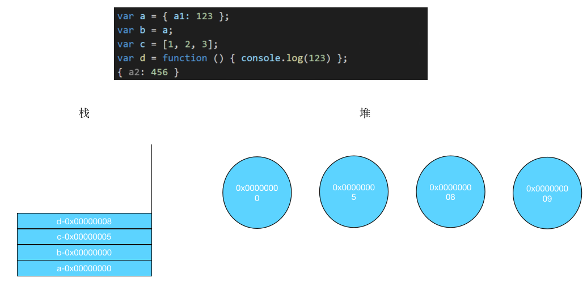
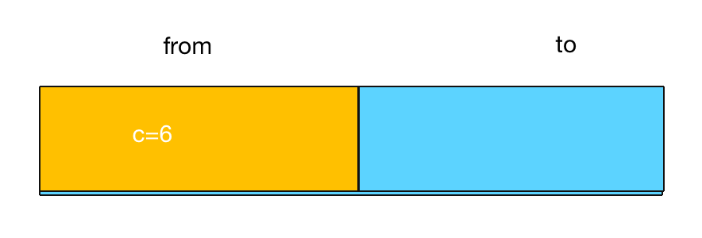
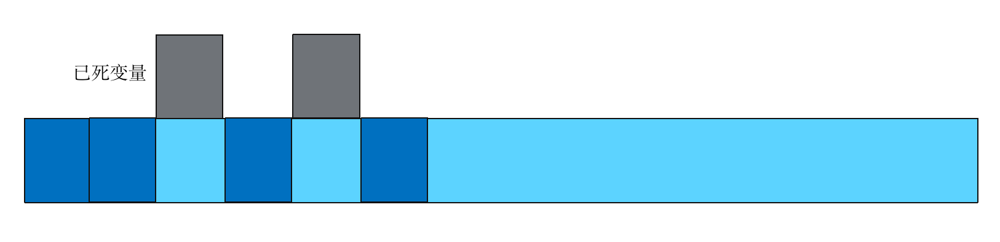

# 一、内存管理

## 1.1 内存的相关概念
### 1.1.1 为什么要关心内存
- 浏览器端：内存过大会让浏览器压力过大，导致浏览器卡顿
- Node端：内存如果不够，服务就会中断，而nodejs开启的服务，如果不管理内存，就会中断
### 1.1.2 内存的数据存储
堆与栈是内存管理数据的两种方式。
#### 栈
栈由操作系统自动分配释放 ，js中普通类型的变量存放于此，其操作方式类似于数据结构中的栈。普通类型变量按照先后定义的顺序依次压入栈中，也就是说相邻变量的地址之间不会存在其它变量。


#### 堆
堆由开发人员分配和释放， 若开发人员不释放，程序结束时由 OS 回收，分配方式类似于链表。js中的方法、对象、数组等引用类型的存储方式如下图所示。栈中用于存储引用类型的地址，堆中存放引用类型的实际数据。



## 1.2 V8内存的管理
V8是一个javascript引擎。javascript引擎将js代码编译成CPU认识的指令集，当然除了编译之外还要负责执行以及内存的管理。
### 1.2.1 V8的内存大小
V8的内存大小在64位下是1.4G ，在32位下是700MB。但是根据浏览器不同，有些许扩容。Node情况下会有一些C++内存扩容
### 1.2.2 V8的内存分配
V8的内存分为新生代和老生代
#### 新生代
短时间存活的新变量会存在新生代种中，新生代的内存量极小，64位下大概是32MB。
新生代使用复制-清空的回收算法。把存活者的变量复制到to空间，然后把from空间清空，然后对调from和to。这样可以提升回收速度，典型的牺牲空间换时间。



#### 老生代
生存时间比较长的变量，会转存到老生代，老生代占据了几乎所有内存。64位下大概是1400MB。
老生代中用标记 - 清除（Mark-Sweep）的算法来处理。首先会标记已死变量，然后清除这些已死变量。清除算法后，会产生大量不连续的内存碎片，因此会进行整理磁盘。



#### 新生代和老生代转化
当新生代使用算法管理内存时，出现一下的情况时，会将新生代的数据转移到老生代
- 新生代发现本次复制后，会占用超过百分之25的to空间。
- 这个对象已经经历过一次回收
### 1.2.3 V8的垃圾回收
#### 回收时机
触发js的回收机制的时机如下：
- 执行完一次代码
- 内存不够的时候
#### 可回收的变量
- 全局变量会直到程序执行完毕，才会回收。
- 普通变量，当他们失去引用时就会回收。
## 1.3 内存优化
了解了内存的基本概念和V8内存管理的机制后，可以进行js程序的内存优化。
### 1.3.1 如何检测内存
要进行内存优化，首先得检测当前内存状态，js提供了如下方法进行内存的检测
- 浏览器端：`window.performance.memory`
- Node端：`process.memoryUsage()`
### 1.3.2 优化建议
- 尽量不要定义全局，定义了及时手动释放
- 注意闭包
- Node可以手动触发垃圾回收 `global.gc`
- Node端可以设置内存 `node --max-old-space-size=1700 *.js` 和 `node --max-new-space-size=1024 *.js` 
对于下面一段代码，运行过程中内存占用会一直上升
```js
function testMemory() {
  var memory = process.memoryUsage().heapUsed;
  console.log(memory / 1024 / 1024 + "mb");
}
var size = 30 * 1024 * 1024
var arr1 = new Array(size);
testMemory();
var arr2 = new Array(size);
testMemory();
var arr3 = new Array(size);
testMemory();
var arr4 = new Array(size);
testMemory();
var arr5 = new Array(size);
testMemory();
var arr6 = new Array(size);
testMemory();
```
改进后，将部分代码放进另一个函数中。当该函数执行完毕后，会释放相应的内存
```js
function testMemory() {
  var memory = process.memoryUsage().heapUsed;
  console.log(memory / 1024 / 1024 + "mb");
}
var size = 30 * 1024 * 1024
var arr1 = new Array(size);
testMemory();
var arr2 = new Array(size);
testMemory();
// var arr3 = new Array(size);
// testMemory();
// var arr4 = new Array(size);
// testMemory();
(function () {
  var arr3 = new Array(size);
  testMemory();
  var arr4 = new Array(size);
  testMemory();
})()
var arr5 = new Array(size);
testMemory();
var arr6 = new Array(size);
testMemory();
```