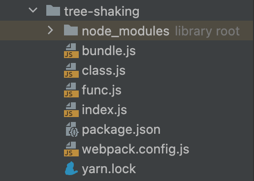
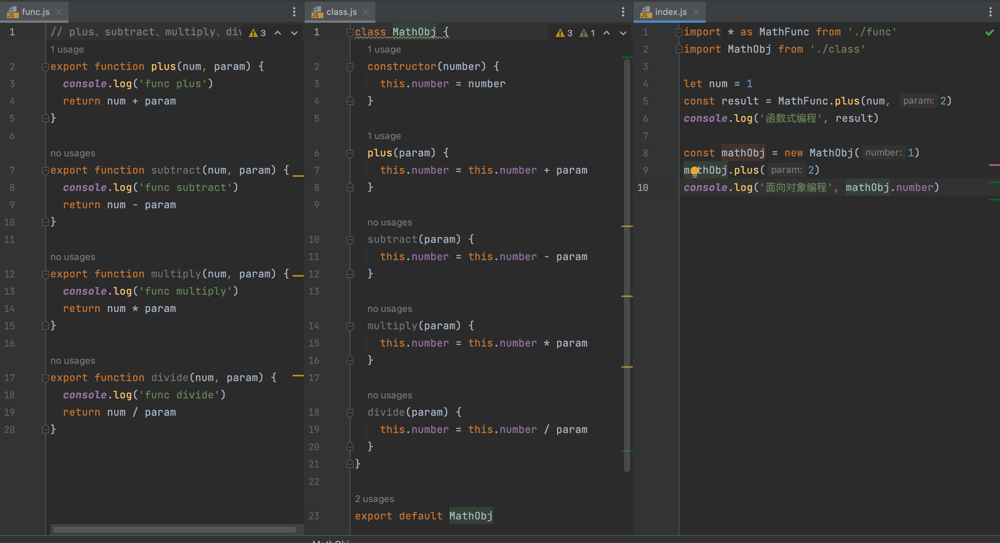

# 二、函数式编程

## 2.1 编程范式

这里所说的函数式编程是一种编程范式。常见的函数式编程有：
- 过程式编程：用一系列流程去完成任务，例如c语言
- 面向对象编程：将一系列的逻辑封装成一个类，例如java
- 函数式编程：用一系列函数去完成任务，例如Scheme
- 声明式编程：只声明目标不指定细节，例如mysql
javascript同时支持函数式编程和面向对象编程。
## 2.2 js编程范式
### 2.2.1 js的面向对象编程
js的面向对象编程是基于原型链的。下面使用class建立一个数学运算类，该类封装了加减乘除四种运算方法。代码如下：
```js
class MathObj {
  constructor(number) {
    this.number = number
  }

  plus(param) {
    this.number = this.number + param
  }
  
  subtract(param) {
    this.number = this.number - param
  }
  
  multiply(param) {
    this.number = this.number * param
  }
  
  divide(param) {
    this.number = this.number / param
  }
}

const mathObj = new MathObj(1)
mathObj.plus(2)
mathObj.subtract(1)
mathObj.multiply(3)
mathObj.divide(2)
console.log(mathObj.number)
```
要使用这些运算方法，首先得新建一个类的实例，通过类的构造函数初始化数字number。然后通过类的实例去调用这些运算方法进行计算。
### 2.2.2 js的函数式编程
同样的需求，再使用函数式编程来做一遍。代码如下所示
```js
function plus(num, param) {
  return num + param
}

function subtract(num, param) {
  return num - param
}

function multiply(num, param) {
  return num * param
}

function divide(num, param) {
  return num / param
}

let num = 1
const result = divide(multiply(subtract(plus(num, 2), 1), 3), 2)
console.log(result)
```
通过比较发现：
使用类进行四则预算，必须得创建一个对象。必将初始值传递给对象属性。之后进行计算都是修改该对象的属性值。
使用函数进行四则运算，就显得更自由。定义的初始值可以被任何地方访问，调用计算方法后返回的值可以继续作为参数被下一个计算函数调用。
何时使用？
对于一系列逻辑相关且稳定的业务可以选择封装成类。类一般用来开发第三方库
对于需要划分更小的颗粒度，且方便后续修改的时候选择函数。函数一般用来写项目的工具。
## 2.3 为什么函数是一等公民
在 JavaScript 中函数是一等公民的说法，主要是基于以下两点
- 因为 JavaScript 中函数也是对象，函数拥有对象的所有能力，也因此函数可被作为任意其他类型对象来对待。当我们说函数是第一类对象（一等公民）的时候，就是说函数也能实现对象的全部功能。
- 同时 JavaScript 中的函数可以存储在一个变量中，可以从函数中返回一个函数，并且可以作为函数参数传递到另一个函数中。由此可见函数的地位，这是其它的一些面向对象的编程语言所不具备的。
## 2.4 为什么选择函数式编程
以上面向对象和函数的比较还不足以说明为什么要选择函数式编程。真正决定函数式编程成为主流的原因是 tree-shaking 机制。
### 2.4.1 什么是 tree-shaking
前端中的 tree-shaking 可以理解为通过工具"摇"我们的 JS 文件，将其中用不到的代码"摇"掉，是一个性能优化的范畴。具体来说，在 webpack 项目中，有一个入口文件，相当于一棵树的主干，入口文件有很多依赖的模块，相当于树枝。实际情况中，虽然依赖了某个模块，但其实只使用其中的某些功能。通过 tree-shaking，将没有使用的模块 code 摇掉，这样来达到删除无用代码的目的。
### 2.4.2 tree-shaking 演示
使用`npm init -y`新建一个npm工程。并配置好webpack，bundle.js作为输出文件，index.js作为程序主入口。代码结构如下：



分别编写函数模块func.js、类模块class.js以及入口程序index.js，代码如下图所示。在主程序中我们只使用了函数模块和类模块中的plus方法。



然后使用webpack对项目进行打包，完毕后查看输出文件bundle.js，其代码（格式化后的）如下所示。可以看到整个类MathObj都被打包进来了，即使只使用到了plus方法。而函数模块中只有plus方法被打包了进去。
```js
(() => {
  "use strict";
  const s = (console.log("func plus"), 3);
  console.log("函数式编程", s);
  const n = new (class {
    constructor(s) {
      this.number = s;
    }
    plus(s) {
      this.number = this.number + s;
    }
    subtract(s) {
      this.number = this.number - s;
    }
    multiply(s) {
      this.number = this.number * s;
    }
    divide(s) {
      this.number = this.number / s;
    }
  })(1);
  n.plus(2), console.log("面向对象编程", n.number);
})();

```
## 2.5 如何函数式编程
1. 保证纯函数
一个函数的返回结果只依赖于他的参数，同样的输入必定有同样的输出。
下面这段代码就不是纯函数，虽然它每次传入的都是a和1，但两次得到的结果是不同的。这是因为a一个全局变量作为参数随时都有被修改的可能。
```js
// 非纯函数
function add(a, b) {
  return a + b;
}

a = 6;
const result_1 = add(a, 1);
console.log('result_1', result_1)

var a = 123;
const result_2 = add(a, 1);
console.log('result_2', result_2)
```
改进之后的纯函数如下所示，不要将全局变量作为函数饿的参数。
```js
// 改为纯函数
function aPlus(c, d) {
  return c + d;
}
```
2. 减少函数副作用
函数副作用就是函数，会影响外部的数据，比如全局变量。
下面这段代码就会产生副作用。参数obj如果是一个深层的对象，使用assign这种浅拷贝方法复制对象会导致后续修改影响到源对象。这里经过函数修改后。返回的对象和源对象的a不同，但是b.c是相同的。显然这是不合理的，经过函数处理后居然改变了入参的，这就是产生了副作用。
```js
// 副作用
var obj = {
  a: 123,
  b: {
    c: 1,
    d: 2,
  }
};
// 改变了函数作用于外的对象值
function objPlus(obj, num) {
  var _obj = Object.assign({}, obj);
  _obj.a += num;
  _obj.b.c = 2
  return _obj;
}
const newObj = objPlus(obj, 1)
console.log(obj)
console.log(newObj)
```
为了避免产生副作用，我们应该使用深拷贝的方式复制对象类型的参数。比如JSON.parse(JSON.stringify(obj))。实际开发中更推荐使用lodash这种第三方库提供的方法进行深拷贝
```js
// 无副作用
function objPlus_2(obj, num) {
  var _obj = JSON.parse(JSON.stringify(obj))
  _obj.a += num;
  _obj.b.c = 3
  return _obj;
}
```