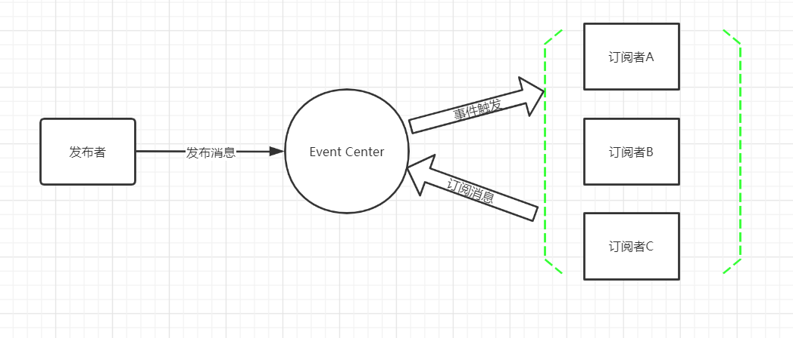
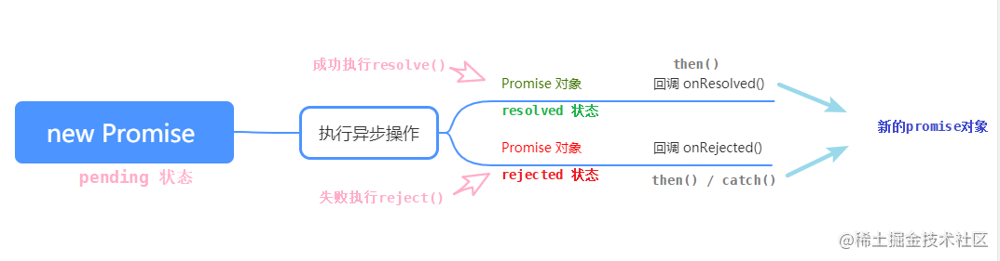

import BrowserWindow from '@site/src/components/BrowserWindow';

# 八、异步编程

下面是一段传统的异步编程标准代码，通过观察此代码可以发现：传统的异步编程代码在异步操作很多且相互依赖时，会形成回调地狱。

```js
let ajax = function (url, cb) {
  // 省略逻辑
}
ajax('/queryOne', function (data1) {
  console.log(data1)
  ajax('/queryTwo' + data1.someProp, function (data2) {
    console.log(data2)
    ajax('/queryThree' + data2.someProp, function (data3) {
      console.log(data3)
    })
  })
})
```
## 8.1 发布-订阅模式
在Promise方案出现之前，发布-订阅模式是主流的异步编程方案。
### 8.1.1 概念
发布-订阅模式其实是一种对象间一对多的依赖关系，当一个对象的状态发送改变时，所有依赖于它的对象都将得到状态改变的通知。
订阅者（Subscriber）把自己想订阅的事件注册（Subscribe）到调度中心（Event Channel），当发布者（Publisher）发布该事件（Publish Event）到调度中心，也就是该事件触发时，由调度中心统一调度（Fire Event）订阅者注册到调度中心的处理代码。
它的优点有：
- 解耦
- 可伸缩性
- 高可靠性
- 可测试性
它的缺点有：
- 无法确保消息被触发或者触发了几次
### 8.1.2 实现
现实中大家都会关注微信公众号，会不定期的收到推送。这个就好比我们订阅了某一类主题，产生消息后，统一推送给所有关注了该公众号的人。



使用发布-订阅模式实现这个功能的思路如下：
1. 创建一个对象，在该对象上创建一个缓存列表（调度中心）
2. subscribe 方法用来把函数 fn 都加到缓存列表中（订阅者注册事件到调度中心）
3. publish 方法取到 arguments 里第一个当做 event，根据 event 值去执行对应缓存列表中的函数（发布者发布事件到调度中心，调度中心处理代码）
4. unSubscribe 方法可以根据 event 值取消订阅（取消订阅）
5. subscribeOnce 方法只监听一次，调用完毕后删除缓存函数（订阅一次）
代码如下所示

```js
let eventEmitter = {
  // 缓存列表
  list: {},
  // 订阅
  subscribe(event, fn) {
    this.list[event] = this.list[event] || [];
    this.list[event].push(fn);
    return this;
  },
  // 监听一次
  subscribeOnce(event, fn) {
    let _self = this;
    function subscribe() {
      _self.unSubscribe(event, subscribe);
      fn.apply(_self, arguments);
    }
    subscribe.fn = fn;
    _self.subscribe(event, subscribe);
    return _self;
  },
  // 取消订阅
  unSubscribe(event, fn) {
    const fns = this.list[event];
    if (!fns) {
      return false;
    }
    if (!fn) {
      // 第二个参数不传，表示清空所有订阅者
      this.list[event] = [];
    } else {
      // 清空指定订阅者
      for (let i = 0; i < fns.length; i++) {
        if (fn === fns[i] || fn === fns[i].fn) {
          fns.splice(i, 1);
          break;
        }
      }
    }
    return this;
  },
  // 发布
  publish() {
    let _self = this;
    const event = Array.prototype.shift.call(arguments);
    const fns = this.list[event];
    if (!fns?.length) {
      return false;
    }
    for (let i = 0; i < fns.length; i++) {
      fns[i].apply(_self, arguments);
    }
    return _self;
  },
};

function user1(content) {
  console.log("用户1订阅了:", content);
}

function user2(content) {
  console.log("用户2订阅了:", content);
}

function user3(content) {
  console.log("用户3订阅了:", content);
}

function user4(content) {
  console.log("用户4订阅了:", content);
}

// 订阅
eventEmitter.subscribe("article", user1);
eventEmitter.subscribe("article", user2);
eventEmitter.subscribe("article", user3);
eventEmitter.publish("article", "文章服务");
// 取消user2方法的订阅
eventEmitter.unSubscribe("article", user2);
eventEmitter.publish("article", "文章服务");

eventEmitter.subscribeOnce("picture", user4);
eventEmitter.publish("picture", "图片服务");
eventEmitter.publish("picture", "图片服务");
```
执行结果如下：

<BrowserWindow>

```
用户1订阅了: 文章服务
用户2订阅了: 文章服务
用户3订阅了: 文章服务
用户1订阅了: 文章服务
用户3订阅了: 文章服务
用户4订阅了: 图片服务
```

</BrowserWindow>

## 8.2 Promise
### 8.2.1 概念
Promise是JS中进行异步编程的新的解决方案。
使用Promise进行异步编程的好处有：
- 指定回调函数的方法更加灵活
- 支持链式调用 ，可以解决回调函数问题
Promise 是一个构造函数，Promise 的构造函数接收一个函数为参数，并且传入两个参数：resolve，reject，分别表示异步操作执行成功后的回调函数和异步操作执行失败后的回调函数。Promise的流程如下所示：



1. 当调用Promise函数时，Promise会立即执行内部定义的一些同步代码，并将状态设置为pending。然后等待异步代码的执行完成。即使Promise内部没有异步代码，也会有一个状态为pending的等待过程。
2. 等待完毕后，如果成功了，Promise会通过resolve传递结果，并将状态设置为resolve，之后会调用then方法处理后续；如果失败了Promise会通过reject传递结果，并将状态设置为reject，之后会调用catch方法捕获错误；pending的状态改变只有一次，且不可逆。
3. 不管最终结果是成功或者失败，如果定义了finally，则会最后处理finally中的逻辑。
## 8.2.2 用法
Promise的基本用法就是`Promise().then().catch().finally()`。
除此之外Promise还可以使用链式调用，在then函数中返回一个新的promise，然后可以继续使用then来获取该promise的结果。当然也可以直接在then中处理新promise的所有逻辑。这种用法主要用来处理多个Promise之间有先后关系的逻辑。
如果需要等待多个promise全部执行完毕得到结果才能处理后续的逻辑时，可以使用`Promise.all`。它接受一个Promise组成的数组，只有当数组中的所有Promise执行完毕后，才会继续执行then中的代码，then接受的返回结果也是一个数组，它与Promise数组一一对应。
展示代码如下所示：

```js
function axios(url, time, isError = false) {
  const promise = new Promise((resolve, reject) => {
    setTimeout(() => {
      if (isError) {
        reject(`${url}的请求出错`);
      } else {
        resolve(`${url}的请求结果`);
      }
    }, time);
  });
  return promise;
}

// promise的基本用法
axios("请求1", 2000, true)
  .then((resolve) => console.log(resolve))
  .catch((e) => {
    console.log(e);
  })
  .finally(() => console.log("请求1执行完毕"));
// promise链式调用
axios("请求2", 1000)
  .then((result) => `${result}: 1`)
  .then((result) => console.log(`${result}: 2`));

// 多个promise先后关系
axios("请求3", 2000).then((resolve_1) => {
  console.log(resolve_1);
  axios("请求4", 1000).then((resolve_2) => {
    console.log(resolve_2);
  });
});

// 多个promise一起完成
Promise.all([axios("请求5", 3000), axios("请求6", 2000)]).then((resolves) => {
  console.log(resolves);
});
```

执行结果如下：

<BrowserWindow>

```
请求2的请求结果: 1: 2
请求1的请求出错
请求1执行完毕
请求3的请求结果
[ '请求5的请求结果', '请求6的请求结果' ]
请求4的请求结果
```

</BrowserWindow>

虽然Promise的写法比起回调函数的写法有很大的改进，但是操作本身的语义却变得不太明朗。
## 8.3 Generator
### 8.3.1 概念
Generator函数是协程在ES6中的实现，最大的特点就是可以交出函数的执行权（即暂停执行）。整个Generator函数就是一个封装的异步任务，或者说就是异步任务的容器。
调用Generator函数，会返回一个内部指针（即遍历器）g，这是Generator函数不同于普通函数的另一个地方，即执行它不会返回结果，返回的是指针对象。调用指针g的next()方法，会移动内部指针（即执行异步任务的第一段），指向第一个遇到的yield语句。每次调用next()方法，会返回一个对象，表示当前阶段的信息（value属性和done属性）。value属性是yield语句后面表达式的值，表示当前阶段的值；done属性是一个布尔值，表示Generator函数是否执行完毕，即是否还有一个阶段。
需要注意的是yeild本身是没有返回值的，将yeild表达式赋值给变量本身是没有意义的，该变量的值是undefiend。但是可以通过调用next()传递参数，该参数可以作为上一个next()执行中yeild的返回值。可以通过如下代码来理解。
```js
function* gen(x) {
  var y = 2 * (yield x + 1);
  var z = yield y / 3;
  return x + y + z;
}

var a = gen(5);
console.log(a.next()); // { value:6, done:false }
console.log(a.next()); // { value:NaN, done:false }
console.log(a.next()); // { value:NaN, done:true }

var b = gen(5);
console.log(b.next()); // { value:6, done:false }
console.log(b.next(12)); // { value:8, done:false } y = 2 * 12 z = y / 3 = 8
console.log(b.next(13)); // { value:42, done:true } x = 5, y = 24 z = 13
```
该代码的每一步执行结果如注释所示。

:::tip 分析
1. 当不传递参数时，初始传值是5。执行第一个next时，yeild后面的表达式的值是6（5+1）。但是yeild本身是没有返回值的，因此y的值是undefined。执行第二个next时，由于y的值时undefined，因此yeild后面表达式的值时NaN。同理执行第三个next时，表达式x+y+z的值也是NaN。此时generator函数执行完毕，done的值是true
2. 当执行第二个next传递参数12时，此时第一个next中yeild返回值是12，因此y的值就是24（2x12）。代入计算第二个next中yeild后面的表达式的值是8（24/3），注意此时z的值仍是undefined。
3. 当执行第三个next传递参数是13时，此时z的值是13，因此x+y+z=5+24+13=42
:::

### 8.3.2 实现
generator函数本身就是异步的逻辑。但是它不能自动执行内部的代码。因此我们需要手动编写generator函数的执行函数。
例如下面这段代码，需要执行读多个文件的异步操作。编写了一个generator函数g，它内部会去读三个文件。为了让这个generator函数自动执行。需要额外编写一个run函数，它的作用很简单，就是g函数没有完成会一直去调用next函数。
```js
const fs = require("fs");
const Thunk = function (fn) {
  return function (...args) {
    return function (callback) {
      return fn.call(this, ...args, callback);
    };
  };
};
const readFileThunk = Thunk(fs.readFile);

function run(fn) {
  var gen = fn();
  function next(err, data) {
    var result = gen.next(data);
    if (result.done) return;
    result.value(next);
  }
  next();
}

const g = function* () {
  console.log(__dirname);
  const s1 = yield readFileThunk(`${__dirname}/promise.js`);
  console.log("promise文件内容：", s1.toString());
  const s2 = yield readFileThunk(`${__dirname}/thunk.js`);
  console.log("thunk文件内容：", s2.toString());
  const s3 = yield readFileThunk(`${__dirname}/yield.js`);
  console.log("yield文件内容：", s3.toString());
};

run(g);
```
这段代码使用了thunk函数。thunk函数的作用非常简单，就是把一个函数的执行参数 回调分成两个函数(可以把函数本身也进行包装) 只要是有回调函数的就可以用thunk进行包装

:::info 这里为什么要定义一个Thunk函数？
Thunk 函数与 Generator 能联系在一起的挈机，就是因为 Thunk 函数接受一个回调函数作为参数。刚好 Generator 函数某个异步操作的结果与往后的代码有关联，需要在异步操作的回调函数中执行生成器的 next() 方法，那么 yield 关键字后面跟着一个 Thunk 函数，就能达到按编写“顺序”去执行代码的效果了
:::

## 8.4 async-await
### 8.4.1 异步编程的终极解决方案
generator函数已经是比较成熟的异步编程方案，相比较于promise，它的代码逻辑更像是同步代码的书写方法。但是它本身无法自动执行，需要我们编写额外的自动执行代码，并在其中定义next函数。这样写出来的代码确实很难理解。因此async-await作为异步编程的终极方案出现了。
所谓async函数，其实是Generator函数的语法糖。async函数就是将Generator函数的星号替换成了async，将yield替换成await，除此之外，还对 Generator做了以下四点改进：
1. 内置执行器。Generator函数的执行依靠执行器，所以才有了co模块等异步执行器。而async函数是自带执行器的。也就是说：async函数的执行，与普通函数一模一样，只要一行。它会自动执行，输出最后结果。这完全不像Generator函数，需要调用next()方法，或者使用co模块，才能得到真正执行，从而得到最终结果。
2. 更好的语义。async和await比起星号和yield，语义更清楚。async表示函数里有异步操作，await表示紧跟在后面的表达式需要等待结果。
3. 更广的适用性。async函数的await命令后面可以是Promise对象和原始类型的值（数值、字符串和布尔值，而这是等同于同步操作）。
4. 返回值是Promise，这比Generator函数返回的是Iterator对象方便多了。你可以用then()指定下一步操作。
### 8.4.2 async-await异步编程
有了async-await后，可以讲上述generator写的读取文件的函数更改如下。将readFileThunk之前难以理解的thunk函数更改成了容易理解的promise函数。而且不需要再额外编写执行器了。
```js
const fs = require("fs");
const readFileThunk = function(url) {
  const promise = new Promise((resolve, reject) => {
    fs.readFile(url, (err, data) => {
      if (err) {
        reject(err)
      } else {
        resolve(data)
      }
    })
  })
  return promise
}

const readFile = async function () {
  const s1 = await readFileThunk(`${__dirname}/promise.js`);
  console.log("promise文件内容：", s1.toString());
  const s2 = await readFileThunk(`${__dirname}/thunk.js`);
  console.log("thunk文件内容：", s2.toString());
  const s3 = await readFileThunk(`${__dirname}/yield.js`);
  console.log("yield文件内容：", s3.toString());
};
```
