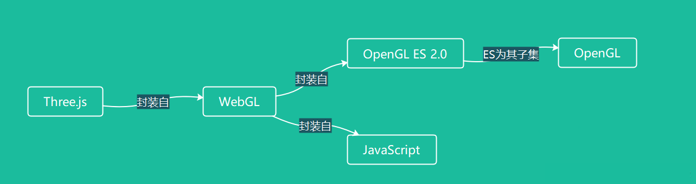
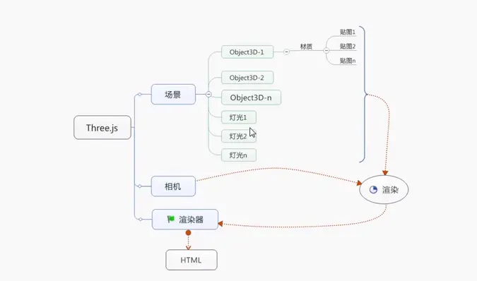

import { IframeWindow } from '@site/src/components/BrowserWindow';
import Tabs from '@theme/Tabs';
import TabItem from '@theme/TabItem';

# 一、Three.js入门

## 1.1  图形学基本知识

### **CPU、GPU的作用**

在计算机里面一个字节是8位，取值范围也就是0-255，如果用一个字节表示一种原色量的取值范围，那么红绿蓝就是三个字节，再加上一个透明度Alpha，RGBA刚好是四个字节，通常是用一个整形int来表示。这样就可以把一个图形给量化成数字，既然已经是数字化了，就可以给计算机处理了。

实际上一张二维的图片，就是一个二维整形矩阵，这些都是我们在CPU和内存都可以操作的逻辑了。最后操作系统把数据交换给显卡，通常是复制到显存，交给了GPU来渲染显示，本质上GPU也是处理了这些数据，根据这些数据来控制显示器在不同的点放射不同量度的原色，这样就能展示图形了。

### **图形库（图形编程API）**

图形领域是十分重要和可发展的，介于操作系统和硬件（驱动）的中间层，可以做很多事情，提供重要的图形编程接口，方便开发二维和三维的图形。于是乎图形编程API出现了。

常见的图形编程api有：DirectX、OpenGL、Metal

- DirectX：Direct eXtension，简称DX。是由微软公司创建的多媒体编程接口。由C++编程语言实现，遵循COM。被广泛使用于Microsoft Windows、Microsoft XBOX、Microsoft XBOX 360和Microsoft XBOX ONE电子游戏开发，并且只能支持这些平台
- OpenGL：全写Open Graphics Library。定义了一个跨编程语言、跨平台的编程接口规格的专业的图形程序接口。它用于三维、二维图形，是一个功能强大，调用方便的底层图形库。
- Metal：是一种低层次的渲染应用程序编程接口，提供了软件所需的最低层，保证软件可以运行在不同的图形芯片上。Metal 提升了苹果 A 系列处理器效能，让其性能完全发挥。与 DX 一样，这不是一个跨平台支持的 API，只针对 iOS、macOS苹果自家的操作系统。

**图形库的工作是把各种物体，通过一些列剪裁、渲染得到一个三维的视觉结果。也就是FPS上的一帧，一幅三维画面，每秒帧越多，给人感觉会越流畅。**

### 图形引擎

引擎是在图形库之上的一个平台。举个例子，我们要创建一个球，可以把球的所有坐标给到图形库，图形库就可以根据这些坐标渲染出一个球出来。但是，这个过程需要我们找到所有的坐标点，况且球产生形变时，这些点的坐标还会改变。显然直接去操作图形库编程是一件很困难的事情。而图形引擎正是为了解决这个问题。

图形库的作用就是归纳算法。可以实现渲染，给顶层开人员发去用。顶层开发人员就根本不必考虑什么算法，散射反射，环境，材质等等。此外有的图形引擎还提供物理引擎、碰撞检测系统、音效引擎、脚本引擎等。有了图形引擎，才能加速开发图形应用。

## 1.2 Three.js介绍

### 什么是Three.js？

Three.js是用JavaScript编写的一个第三方库，用于实现很多的3D功能。而此Three.js正是封装的WebGL这个库，WebGL又是封装的OpenGL ES 2.0与JavaScript。而OpenGLES 2.0又是OpenGL 三维图形 API 的一个子集，而OpenGL是用于渲染2D、3D矢量图形的跨语言、跨平台的图形编程接口（API）。其关系如下所示：



简而言之，WebGL是基于OpenGL的图形库，而Three.js是基于WebGL封装的图形引擎。

### Three.js的优缺点

优点

- WebGL原生的api是一种非常低级的接口，而且还需要一些数学和图形学的相关技术。对于没有相关基础的人来说，入门真的很难，Three.js将入门的门槛降低了整整的一大截，对WebGL进行封装，简化我们创建三维动画场景的过程。
- Three.js掩盖了3D渲染的细节、面向对象、功能非常丰富、速度很快、包含数学库、内置文件格式支持、扩展性很强。

缺点

- 官网文档非常粗糙，国内的相关资源匮乏，对于新手极度不友好。
- Three.js不是游戏引擎，一些游戏相关的功能没有封装在里面，如果需要相关的功能需要进行二次开发。

### Babylon.JS（其它WebGL引擎）

Babylon.JS是最好的JavaScript3D游戏引擎，它能创建专业级三维游戏。主要以游戏开发和易用性为主。与Three.js之间的对比：

- Three.js比较全面，而Babylon.js专注于游戏方面。
- Babylon.js提供了对碰撞检测、场景重力、面向游戏的照相机，Three.js本身不自带，需要依靠引入插件实现。
- 对于WebGL的封装，双方做的各有千秋，Three.js浅一些，好处是易于扩展，易于向更底层学习；Babylon.js深一些，好处是易用扩展难度大一些。
- Three.js的发展是依靠社区推动，出来的比较早，发展比较成熟，Babylon.js是由微软公司在2013推出，文档和社区都比较健全，国内还不怎么火。

## 1.3 Three.js第一次上手

### Three.js三要素

一个典型的 Three.js 程序至少要包括渲染器（Renderer）、场景（Scene）、照相机（Camera），以及你在场景中创建的物体。



### 场景

在 Three.js 中添加的物体都是添加到场景中的，因此它相当于一个大容器。在程序最开始的时候进行实例化，然后将物体添加到场景中即可。

也就是说，场景是光源和所有物体的父容器。

### 相机

相机就像人的眼睛一样，人站在不同位置，抬头或者低头都能够看到不同的景色。在Threejs中有多种相机，透视相机（THREE.PerspectiveCamera）用的最多。相机的作用就是指向场景，在场景中取一个合适的景，把它拍下来。

### 渲染器

WebGL 的渲染是需要 HTML5 Canvas 元素的，所以需要在部分中定义Canvas 元素，或者使用 js 生成。

Canvas绘元素本身是没有绘图能力的，所有的绘制工作必须在 JavaScript 内部通过绘图上下文来完成。绘制2d图形使用的是`2d`上下文，绘制3d图形正是用的`webgl`上下文。

渲染器创建完成后将它添加到页面元素中去。

### 实现代码

首先进入页面后，需要创建一个场景（scene）。然后可以在场景中添加光照和网格模型。光源有很多种，你可以向场景中添加多个光源；网格模型则是有一个几何体与材质共同构成的。然后创建一个渲染器，并将它添加到页面元素（div）中。

运行如下代码，这样第一个three.js程序就完成了！

```mdx-code-block
<Tabs>
<TabItem value="html" label="HTML">
```

```html
<!DOCTYPE html>
<html lang="en">
  <head>
    <meta charset="UTF-8" />
    <link rel="icon" type="image/svg+xml" href="/vite.svg" />
    <meta name="viewport" content="width=device-width, initial-scale=1.0" />
    <link rel="stylesheet" href="../reset.css">
    <title>第一个three.js应用</title>
  </head>
  <body>
    <!-- <canvas id="app"></canvas> -->
    <script type="module" src="./index.js"></script>
  </body>
</html>
```
    
```mdx-code-block
</TabItem>
<TabItem value="js" label="JavaScript">
```

```jsx
import * as THREE from "three";

const sizes = {
  width: window.innerWidth,
  height: window.innerHeight,
}

/** --- 创建一个场景 --- */
const scene = new THREE.Scene();

/** --- 创建一个网格模型 --- */
// 创建一个几何体
const geometry = new THREE.BoxGeometry(1, 1, 1);
// 创建一个材质对象
const material = new THREE.MeshLambertMaterial({ color: 0x0000ff });
// 创建一个网格模型对象
const mesh = new THREE.Mesh(geometry, material);
// 将网格模型对象添加到场景中
scene.add(mesh);

/** --- 设置光源 --- */
// 点光源
const point = new THREE.PointLight(0xffffff);
point.position.set(4, 2, 3);
scene.add(point);
//环境光
const ambient = new THREE.AmbientLight(0x444444);
scene.add(ambient);

/** --- 创建相机 --- */
const camera = new THREE.PerspectiveCamera(
  75,
  sizes.width / sizes.height,
  0.1,
  1000
);
camera.position.z = 3
scene.add(camera)

/** --- 创建渲染器 --- */
const renderer = new THREE.WebGLRenderer();
// 设置渲染区域尺寸
renderer.setSize(sizes.width, sizes.height);
// 设置背景颜色
renderer.setClearColor(0xb9d3ff, 1); 
// 将渲染器添加到画布中去
document.body.appendChild(renderer.domElement)
// 执行渲染操作。指定场景、相机作为参数
renderer.render(scene, camera);
```

```mdx-code-block
</TabItem>
</Tabs>
```

效果如下图所示：

<IframeWindow url="/threejs-tutorial/1-introduction/index.html" />
