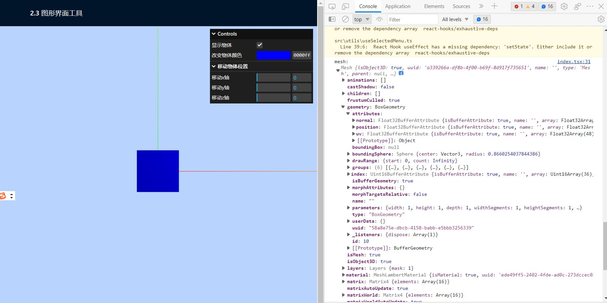

import { IframeWindow } from '@site/src/components/BrowserWindow';
import Tabs from '@theme/Tabs';
import TabItem from '@theme/TabItem';

# 三、探究Three.js中的物体

## 3.1 几何知识

两点确定一条直线；三点确定一个面。在three.js中，物体都是由一系列的点所构成的。

在当前项目中，点击2-3节的页面。打开控制台，会输出一个Mesh对象，该对象里面的geometry对象就是途中所示的几何体。



该geometry的类型是BoxGeometry，它是Three.js提供的一个立方缓冲几何体，详情可以查看three.js官方文档。

<IframeWindow url="https://threejs.org/docs/index.html?q=Geometry#api/zh/geometries/BoxGeometry" />

除了BoxGeometry外，three.js还提供了CircleGeometry、RingGeometry等一系列常见的几何体。通过拖拽几何体胖的参数设置，发现他们都是由顶点构成三角面，然后在由三角面构成几何体，当顶点越多，几何体就越接近我们熟悉的形状。

这些几何体都继承自BufferGeometry这个基类。它是面片、线或点几何体的有效表述。包括顶点位置，面片索引、法相量、颜色值、UV 坐标和自定义缓存属性值。使用BufferGeometry 可以创建任何形状的集合体。

## 3.2 自定义一个矩形几何体

### 使用BufferGeomery自定义几何体

有了上面的知识，我们可以用BufferGeomery创建一个矩形几何体。

首先，一个矩形平面可以看做是由两个三角形平面构成的，而一个三角形平面是由三个顶点所确定的，而每个顶点是由三个坐标值组成。因此，用Float32Array创建一个数组，它有18个值（6个顶点），其中有两个顶点是一样的。然后通过BufferGeometry的setAttribute设置几何体的顶点属性。传递的第一个参数是属性值名；第二个参数是一个BufferAttribute对象，它的第二个属性表示以三个值为一组构成一个顶点。

其次，我们再给每个顶点设置法向量。当然也可以不设置，但是这样运行代码后几何体的表面会非常阴暗。这是因为光的反射原理涉及到法向量，如果不设置法向量，那么点光源、平行光等带有方向性的光源不会起作用。设置法向量的思路同设置顶点相同，一个顶点对应一个法向量，一共有6个法向量（18个数组值）。然后再通过BufferGeometry的setAttribute设置几何体的normal属性。这时候再运行代码，会发现几何体表面有了光泽。

```tsx
/** --- 创建一个场景 --- */
scene = new THREE.Scene();

/** --- 创建一个网格模型 --- */
// 创建一个几何体
const geometry = new THREE.BufferGeometry();
// 因为在两个三角面片里，一共有六个顶点，其中两个顶点是一模一样的。
const vertices = new Float32Array([
  -1.0, -1.0, 1.0, 1.0, -1.0, 1.0, 1.0, 1.0, 1.0,
  1.0, 1.0, 1.0, -1.0, 1.0, 1.0, -1.0, -1.0, 1.0,
]);
// 顶点的法线向量，设置后可以突出光照
const normals = new Float32Array([
  0,0,1,0,0,1,0,0,1,
  0,0,1,0,0,1,0,0,1
])
// 一个顶点由三个坐标表示，因此创建时，三个坐标值为一组
geometry.setAttribute("position", new THREE.BufferAttribute(vertices, 3));
geometry.setAttribute("normal", new THREE.BufferAttribute(normals, 3))

// 创建一个材质对象
const material = new THREE.MeshLambertMaterial({ color: 0x0000ff });
// 创建一个网格模型对象
const mesh = new THREE.Mesh(geometry, material);
// 将网格模型对象添加到场景中
scene.add(mesh);
```

### 使用索引index复用顶点

上面虽然使用BufferGeometry的position、normal属性自定义了一个矩形几何体，但是六个顶点中有两个是完全重复的。同样的，法向量也只需要四个即可。那么我们直写四个顶点和四个法向量可以吗？

显然这是不行的，这样修改后，显示出来的几何体是一个三角形。为了解决这个问题，BufferGeomery的index属性提供了使用索引来复用顶点。index实现了将四个点的索引映射到了六个点上，这样修改position，normal属性时，会根据这六个映射点所持有的的索引去找真正的点坐标。

这样修改后运行代码，效果图与上面一模一样！

```tsx
/** --- 创建一个场景 --- */
scene = new THREE.Scene();

/** --- 创建一个网格模型 --- */
// 创建一个几何体
const geometry = new THREE.BufferGeometry();
// 使用index（索引）复用顶点
const vertices = new Float32Array([
  -1.0, -1.0, 1.0,   1.0, -1.0, 1.0,
  1.0, 1.0, 1.0,   -1.0, 1.0, 1.0, 
]);
// 顶点的法线向量，设置后可以突出光照
const normals = new Float32Array([
  0, 0, 1, 0, 0, 1,
  0, 0, 1, 0, 0, 1
])
const indexes = new Uint16Array([
  // 0对应第1个顶点位置数据、第1个顶点法向量数据
  // 1对应第2个顶点位置数据、第2个顶点法向量数据
  // 索引值3个为一组，表示一个三角形的3个顶点
  0, 1, 2,
  0, 2, 3,
])
// 一个顶点由三个坐标表示，因此创建时，三个坐标值为一组
geometry.setAttribute("position", new THREE.BufferAttribute(vertices, 3));
geometry.setAttribute("normal", new THREE.BufferAttribute(normals, 3))
geometry.index = new THREE.BufferAttribute(indexes, 1) 

// 创建一个材质对象
const material = new THREE.MeshLambertMaterial({ color: 0x0000ff });
// 创建一个网格模型对象
const mesh = new THREE.Mesh(geometry, material);
// 将网格模型对象添加到场景中
scene.add(mesh);
```

效果如下所示：

<IframeWindow url="https://winddancer.gitee.io/threejs-tutorial/3-object/customObject.html" />

## 3.3 创建随机几何体

在一些网站里，我们经常会看到一些炫酷的随机几何体形状的物体。这个炫酷的物体实现的方式有很多，这一次我们来用three.js创建一个炫酷的随机几何体。实现方式很简单，就是用`Math.random`创建一系列随机值，然后将其转化为`Float32Array` 对象，并将它作为几何体的顶点。相关代码如下所示

```tsx
/** --- 创建一个场景 --- */
const scene = new THREE.Scene();

/** --- 创建一个网格模型 --- */
// 创建一个几何体
const geometry = new THREE.BufferGeometry();

const triangleVertices = [];
for (let index = 0; index < 300; index += 1) {
  triangleVertices.push(Math.random() - 0.5);
}

const vertices = new Float32Array(triangleVertices);

geometry.setAttribute("position", new THREE.BufferAttribute(vertices, 3));

// 创建一个材质对象
const material = new THREE.MeshLambertMaterial({
  color: 0x607d8b,
  wireframe: true,
});
// 创建一个网格模型对象
const mesh = new THREE.Mesh(geometry, material);
// 将网格模型对象添加到场景中
scene.add(mesh);
```

效果如下所示：

<IframeWindow url="https://winddancer.gitee.io/threejs-tutorial/3-object/randomObject.html" />
