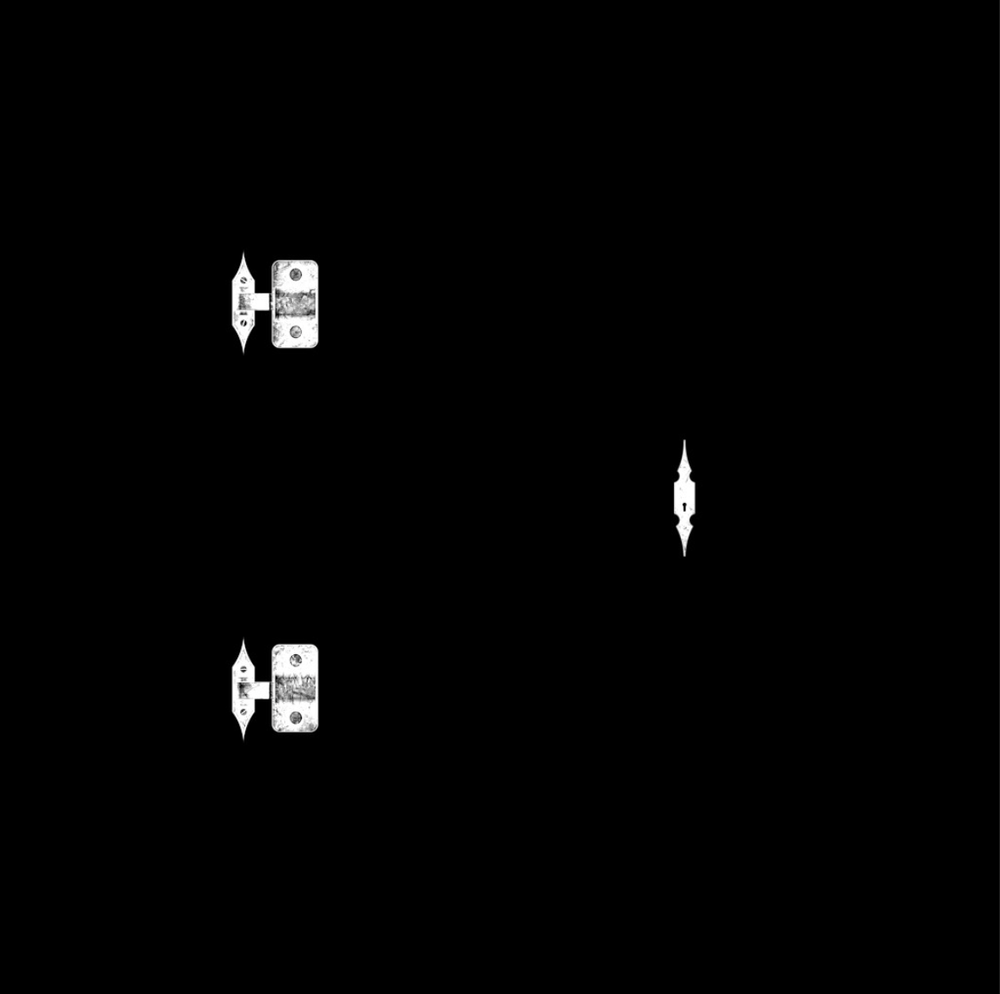

# 四、材质与纹理

## 4.1 加载纹理

纹理是加载到材质上的，材质有很多中。这里我们使用基础材质，由three.js提供MeshBasicMaterial构造方法。该方法的参数map可以接受纹理图片。

加载纹理图片由TextureLoader这个方法来实现。我们只需通过new一个实例对象，然后调用该实例对象的load方法即可加载图片。

TextureLoader构造方法有一个参数loadingManager，该参数类型是LoadingManager。可以自行定义onStart、onProgress、onLoad、onError等方法，这些方法会在所有资源开始加载、加载中、加载完毕、加载失败时进行毁掉。

加载纹理的相关代码如下所示：

```tsx
const Chapter4_1 = () => {
  const ref = useRef<HTMLDivElement>(null);
  const size = useSize(ref);
  const [loadTip, setLoadTip] = useState<string>("");

  const initThree = () => {
    /** --- 创建一个场景 --- */
    scene = new THREE.Scene();

    /** --- 创建一个网格模型 --- */
    // 创建一个几何体
    const geometry = new THREE.BoxGeometry();

    const loadingManager = new THREE.LoadingManager();
    loadingManager.onStart = (url, itemsLoaded, itemsTotal) => {
      setLoadTip(
        `开始加载资源: ${url}.\nLoaded ${itemsLoaded} of ${itemsTotal} files.`
      );
    };
    loadingManager.onProgress = (url, itemsLoaded, itemsTotal) => {
      setLoadTip(
        `加载资源中: ${url}.\nLoaded ${itemsLoaded} of ${itemsTotal} files.`
      );
    };
    loadingManager.onLoad = () => {
      setLoadTip("加载资源完成");
    };
    loadingManager.onError = (url) => {
      setLoadTip(`加载资源出错 ${url}`);
    };

    const textureLoader = new THREE.TextureLoader(loadingManager);
    const colorTexture = textureLoader.load("/textures/door/color.jpg");
    const alphaTexture = textureLoader.load("/textures/door/alpha.jpg");
    const heightTexture = textureLoader.load("/textures/door/height.jpg");
    const normalTexture = textureLoader.load("/textures/door/normal.jpg");
    /** -- 加载众多资源 --- */

    // 创建一个材质对象
    const material = new THREE.MeshBasicMaterial({ map: colorTexture });
    // 创建一个网格模型对象
    const mesh = new THREE.Mesh(geometry, material);
    // 将网格模型对象添加到场景中
    scene.add(mesh);

		/** --- other codes --- */

    render();
  };
 
	/** --- other codes --- */

  return (
    <div id="container" style={{ width: "100%", height: "100%" }} ref={ref}>
      <div className="load-tip" id="tip">{loadTip}</div>
    </div>
  );
};

export default Chapter4_1;
```

## 4.2 纹理变换

可以像之前给mesh设置各种变换一样，我们也可以给纹理设置变换属性，包括重复、偏移、旋转等。

在设置重复属性时，不仅需要设置x和y轴重复的次数，还需要指定包裹模式。如果只设置重复次数属性，那么会看到并没有 repeat，而是边缘的像素被拉伸了。

其中 `wrapS` 这个值定义了纹理贴图在水平方向上将如何包裹，在 UV 映射中对应于 U。`wrapT` 这个值定义了纹理贴图在垂直方向上将如何包裹，在 UV 映射中对应于 V。
默认值是 `THREE.ClampToEdgeWrapping`，即纹理边缘将被推到外部边缘的纹素。 其它的两个选项分别是 `THREE.RepeatWrapping` 和 `THREE.MirroredRepeatWrapping`。

- `ClampToEdgeWrapping` 是默认值，纹理中的最后一个像素将延伸到网格的边缘
- `RepeatWrapping`，纹理将简单地重复到无穷大。
- `MirroredRepeatWrapping`， 纹理将重复到无穷大，在每次重复时将进行镜像。

偏移只需要在x和y轴的偏移量，即可达到偏移的效果。旋转需要设置旋转的角度，还可以设置旋转中心。相关代码如下所示：

```tsx
const initThree = () => {
  /** --- 创建一个场景 --- */
  scene = new THREE.Scene();

  /** --- 创建一个网格模型 --- */
  // 创建一个几何体
  const geometry = new THREE.BoxGeometry();

  const loadingManager = new THREE.LoadingManager();
  loadingManager.onStart = (url, itemsLoaded, itemsTotal) => {
    setLoadTip(
      `开始加载资源: ${url}.\nLoaded ${itemsLoaded} of ${itemsTotal} files.`
    );
  };
  loadingManager.onProgress = (url, itemsLoaded, itemsTotal) => {
    setLoadTip(
      `加载资源中: ${url}.\nLoaded ${itemsLoaded} of ${itemsTotal} files.`
    );
  };
  loadingManager.onLoad = () => {
    setLoadTip("加载资源完成");
  };
  loadingManager.onError = (url) => {
    setLoadTip(`加载资源出错 ${url}`);
  };

  const textureLoader = new THREE.TextureLoader(loadingManager);
  const colorTexture = textureLoader.load("/textures/door/color.jpg");

  // 纹理变换
  colorTexture.repeat.x = 2;
  colorTexture.repeat.x = 3;
  // 以上两个设置并没有repeat，而是边缘的像素被拉伸了，需要再设置属性wrapS和wrapT
  colorTexture.wrapS = THREE.RepeatWrapping;
  colorTexture.wrapT = THREE.RepeatWrapping;
  // colorTexture.wrapS = THREE.MirroredRepeatWrapping;
  // colorTexture.wrapT = THREE.MirroredRepeatWrapping;
  // 设置偏移属性
  colorTexture.offset.x = 0.5
  colorTexture.offset.y = 0
  // 设置旋转属性
  colorTexture.rotation = Math.PI / 4
  colorTexture.center = new Vector2(0.5, 0.5)

  // 创建一个材质对象
  const material = new THREE.MeshBasicMaterial({ map: colorTexture });
  // 创建一个网格模型对象
  const mesh = new THREE.Mesh(geometry, material);
  // 将网格模型对象添加到场景中
  scene.add(mesh);

  /** --- other codes --- */

  render();
};
```

## 4.3 纹理显示算法与mipmap

大部分情况下，纹理使用的图片大小与物体的尺寸大小是不一致的。那么一个尺寸很小的图片作为纹理用在物体上会是什么样的效果呢？

我们接下来使用`/textures/minecraft.png` 这个路径下的图片作为纹理。它是一个尺寸非常小的图片，将其放大后可以看出它大概是长这样的。


然后我们将它作为纹理，运行程序后，层现在我们眼前的物体是这个样子的。


显然，实际层现出来的物体纹理看起来很模糊。这是因为物体的尺寸、分辨率和图片的尺寸、分辨率是不同的。three.js使用Filtering and Mipmapping对图片进行了处理。

<aside>
💡 在三维计算机图形的贴图渲染中有一个常用的技术被称为 Mipmapping。为了加快渲染速度和减少图像锯齿，贴图被处理成由一系列被预先计算和优化过的图片组成的文件, 这样的贴图被称为 MIP map 或者 mipmap。这个技术在三维游戏中被非常广泛的使用。

</aside>

Filtering and Mipmapping有**Magnification filter（放大滤镜）**和**Minification filter（缩小滤镜）。**

这两个属性的枚举值如下所示：

- THREE.NearestFilter
- THREE.NearestMipmapNearestFilter
- THREE.NearestMipmapLinearFilter
- THREE.LinearFilter
- THREE.LinearMipmapNearestFilter
- THREE.LinearMipmapLinearFilter

默认值是LinearMipmapNearestFilter，它选择与被纹理化像素的尺寸最接近的两个mipmap， 并以LinearFilter为标准来从每个mipmap中生成纹理值。最终的纹理值是这两个值的加权平均值。因此它层现出的纹理颜色变化没有原图那么突兀，因此看起来也比原图模糊。

而THREE.NearestFilter 返回与指定纹理坐标（在曼哈顿距离之内）最接近的纹理元素。现在我们将该纹理图片的放大滤镜设置为NearestFilter。相关的代码如下所示：

```tsx
const initThree = () => {
  /** --- 创建一个场景 --- */
  scene = new THREE.Scene();

  /** --- 创建一个网格模型 --- */
  // 创建一个几何体
  const geometry = new THREE.BoxGeometry();

  const loadingManager = new THREE.LoadingManager();
  loadingManager.onStart = (url, itemsLoaded, itemsTotal) => {
    setLoadTip(
      `开始加载资源: ${url}.\nLoaded ${itemsLoaded} of ${itemsTotal} files.`
    );
  };
  loadingManager.onProgress = (url, itemsLoaded, itemsTotal) => {
    setLoadTip(
      `加载资源中: ${url}.\nLoaded ${itemsLoaded} of ${itemsTotal} files.`
    );
  };
  loadingManager.onLoad = () => {
    setLoadTip("加载资源完成");
  };
  loadingManager.onError = (url) => {
    setLoadTip(`加载资源出错 ${url}`);
  };

  const textureLoader = new THREE.TextureLoader(loadingManager);
  const texture = textureLoader.load("/textures/minecraft.png");

  texture.minFilter = THREE.NearestFilter;
  texture.magFilter = THREE.NearestFilter;

  // 创建一个材质对象
  const material = new THREE.MeshBasicMaterial({ map: texture });
  // 创建一个网格模型对象
  const mesh = new THREE.Mesh(geometry, material);
  // 将网格模型对象添加到场景中
  scene.add(mesh);

	/** --- other codes --- */

  render();
};
```

最终展示的纹理图像如下所示，比起之前的图像更加的清晰锐利，这正是放大滤镜对图片的处理。


## 4.4 基础材质参数

基础网格材质是一个以简单着色（平面或线框）方式来绘制几何体的材质。这种材质不受光照的影响。

### 4.4.1 **wireframe**

将几何体渲染为线框。默认值为**false**（即渲染为平面多边形）。

在本节使用的几何体为正方体。它的每一个面是一个正方形，而一个正方形是由两个三角形拼接而成的。因此它的线框渲染结果如下图所示：


### 4.4.2 透明度与透明度贴图

`transparent`定义此材质是否透明。这对渲染有影响，因为透明对象需要特殊处理，并在非透明对象之后渲染。 设置为true时，通过设置材质的opacity属性来控制材质透明的程度。默认值为false。 

`opacity`值为在 0.0 - 1.0 的范围内的浮点数，表明材质的透明度。值 0.0 表示完全透明，1.0 表示完全不透明。 如果材质的 transparet 属性未设置为 true，则材质将保持完全不透明，此值仅影响其颜色。 默认值为 1.0。

`alpha`贴图是一张灰度纹理，用于控制整个表面的不透明度。（黑色：完全透明；白色：完全不透明）。 默认值为null。

下图是一张透明度贴图，白色的地方代表被留下来的，而黑色的地方代表会被过滤掉的。


我们将使用下图所示的颜色贴图，再使用了上述的透明度贴图后，门的区域以外的将完全被过滤掉


### 4.4.3 环境遮挡贴图

ambient occlusion map，该纹理的红色通道用作环境遮挡贴图。默认值为null。aoMap需要第二组UV。

环境遮挡贴图如下图所示。


要使环境贴图生效，首先得给几何体添加第二组 uv 属性，相关代码如下：

```tsx
geometry.setAttribute(
  "uv2",
  new THREE.BufferAttribute(geometry.attributes.uv.array, 2)
);
```

**`aoMapIntensity`** 是环境遮挡效果的强度。默认值为1。零是不遮挡效果。通过调节该值，可以更直观的看到阴影效果强度。


### 4.4.4 渲染面

side定义将要渲染哪一面：正面，背面或两者。 默认为 THREE.FrontSide。其他选项有 THREE.BackSide 和 THREE.DoubleSide。

要注意的是，THREE.DoubleSide 尽量不要使用，因为会给 GPU 带来更多大压力

设置 THREE.DoubleSide 效果如下，可以看到门的背面也被附上了纹理。


## 4.5 标准材质参数

`MeshStandardMaterial` 是基于物理渲染的（physically based rendering, PBR）。它支持光效，并有一个更拟真的算法，支持了更多参数如粗糙度、金属性。

之所以是 Standard 因为 PBR 已经在很多软件、引擎和库里成为一种标准。

### 4.5.1 置换贴图

`displacementMap`置换贴图又名位移贴图。它会影响网格顶点的位置，与仅影响材质的光照和阴影的其他贴图不同，移位的顶点可以投射阴影，阻挡其他对象， 以及充当真实的几何体。位移纹理是指：网格的所有顶点被映射为图像中每个像素的值（白色是最高的），并且被重定位。

这里使用的置换贴图如下图所示：


`displacementScale`置换贴图对网格的影响程度（黑色是无位移，白色是最大位移）。如果没有设置位移贴图，则不会应用此值。默认值为1。通过调节`displacementScale` 的值，发现该值越大，门凸起的程度越大。


### 4.5.2 金属度贴图

`metalnessMap` 是金属度贴图。该纹理的蓝色通道用于改变材质的金属度。

使用的金属度贴图如下所示，它用来使门锁更具有金属质感。通常可与粗糙度贴图一起使用。



### 4.5.3 粗糙度贴图

`roughnessMap` 是粗糙度贴图。该纹理的绿色通道用于改变材质的粗糙度。

使用的粗糙度贴图如下所示，它用来改变门锁的粗糙度。


`roughness`材质的粗糙程度。0.0表示平滑的镜面反射，1.0表示完全漫反射。默认值为1.0。如果还提供roughnessMap，则两个值相乘。通过改变该值，发现粗糙程度越明显。

### 4.5.4 法线贴图

`normalMap`用于创建法线贴图的纹理。RGB值会影响每个像素片段的曲面法线，并更改颜色照亮的方式。法线贴图不会改变曲面的实际形状，只会改变光照。

使用的法线贴图如下图所示；


使用了法线贴图后，法线门缝之间棱角更加分明。


## 4.6 环境贴图

环境贴图，在几何体上用于反射出周围环境的一种纹理贴图。

其主要包括两种模式，一种是球面环境纹理，另一种是立方体环境纹理模式。两种实现方式原理上与地图学中的投影相似。

- 球形全景是将球形的经度和纬度坐标，直接到水平和垂直坐标的一格，这个网格的高度大约宽的两倍。因此从赤道到两极，横向拉伸不断加剧，南北两个极点被拉伸成了扁平的网格在整个上部和下部边缘。球形全景可以现实整个水平和竖直的360全景。
- 立方体全景是将全景图分成了前后左右上下六个面，浏览的时候将六个面结合成一个密闭空间来现实整个水平和竖直的360全景。

实现原理可以参考如下文章

[Web全景图的原理及实现](https://zhuanlan.zhihu.com/p/30601155)

### 4.6.1 使用环境贴图

这里使用CubeTextureLoader加载立方体环境纹理。它是纹理贴图CubeTexture的一个加载类。 内部使用ImageLoader来加载文件。px/nx/py/ny/pz/nz：该六个配置项分别表示盒模型六个贴面在坐标系中不同方向的贴图地址。

```tsx
const cubeTextureLoader = new THREE.CubeTextureLoader();
const envMapTexture = cubeTextureLoader.load([
  "/textures/environmentMaps/1/px.jpg",
  "/textures/environmentMaps/1/nx.jpg",
  "/textures/environmentMaps/1/py.jpg",
  "/textures/environmentMaps/1/ny.jpg",
  "/textures/environmentMaps/1/pz.jpg",
  "/textures/environmentMaps/1/nz.jpg",
]);
// 给场景添加背景
scene.background = envMapTexture;
// 给场景所有的物体添加默认的环境贴图
scene.environment = envMapTexture;
```

添加上述所示的代码，可以得到如下所示的环境贴图效果。


### 4.6.2 HDR****环境纹理****

上述使用环境贴图的方式需要六张图片才能生成环境纹理。如果使用hdr的话，只需要一张图片就能生成环境纹理。

HDR全称High-Dynamic Range（高动态光照渲染），通过HDR，显示器或相机可以很好的表现超出其亮度范围的图像，也可以简单理解为HDR能大幅提高画面细节的明暗对比度。直白点讲，HDR是指一个图像中最亮处和最暗处之间的比值，能够让图像明亮的地方更亮，而黑色的地方更黑暗深邃。
这里使用RGBELoader来加载hdr图片。这里需要在加载完毕后给纹理映射设置为THREE.EquirectangularReflectionMapping。这样才能将一张图片设置成360°全息图。

```tsx
const rgbeLoader = new RGBELoader();
rgbeLoader.loadAsync("/textures/hdr/002.hdr").then((texture) => {
  texture.mapping = THREE.EquirectangularReflectionMapping;
  scene.background = texture;
  scene.environment = texture;
});
```

最终的效果如下图所示：

