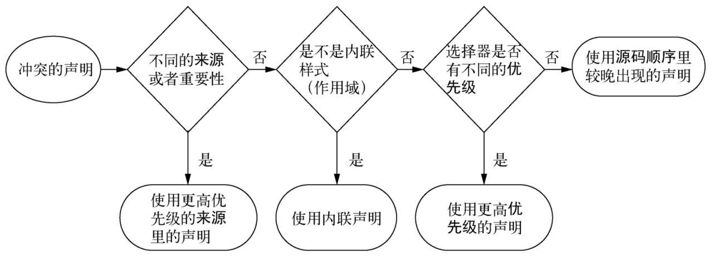

# 一、优先级和继承

## 1. 层叠

层叠指的就是一系列规则。它决定了如何解决冲突，是CSS语言的基础。
下面是层叠的规则。当声明冲突时，层叠会依据三种条件解决冲突。

1. 样式表的来源：样式是从哪里来的，包括你的样式和浏览器默认样式等。
2. 选择器优先级：哪些选择器比另一些选择器更重要。
3. 源码顺序：样式在样式表里的声明顺序。



### 样式表的来源
样式表的来源一般是两种：作者样式表（浏览器请求的css文件）和用户代理样式表（浏览器默认样式）。用户代理样式表优先级低，作者样式表会覆盖它们。

用户代理样式在不同浏览器上稍有差异，它设置了用户普遍需要的样式，不会做一些完全超出预期的事情。一般是为标题（`<h1>`到`<h6>`）和段落（`<p>`）添加上下外边距，为列表（`<ol>`和`<ul>`）添加左侧内边距，为链接添加颜色，为元素设置各种默认字号等。

一般开发时，会写一个reset.css文件即作者样式表。专门用来覆盖浏览器的默认样式。

### 理解优先级

如果无法用来源解决冲突声明，浏览器会尝试检查它们的优先级。优先级比较顺序如下：

- 内联样式
- ID 选择器
- 伪类
- 属性选择器
- 类选择器
- 元素(类型)选择器
- 通用选择器(*)

上述每个规则都有一个权重，而且前一个规则的权重远大于后一个的权重。例如：如果一个元素有内联样式，那么内联样式中的属性生效，其它css文件中与内联样式中的同名的属性全部无效；如果某个属性没有内联样式，却在多个选择器中有该属性的样式，那么先看有id的选择器，如果这样的选择器有多个，就看哪个选择器的id更多,id一样多就看谁的伪类多，伪类一样多的话，再看谁的属性选择器多，依次往下比较。没有id就继续比较有伪类的，以此类推…

如果出现了权重相同的。那么最后声明的属性生效，前面声明的同名属性全部无效。

以上可以简单理解为通用选择器的权重是1；元素选择器的权重是100，这里100表示权重数量级的差别，可以理解为无数个通用选择器的权重加起来不如一个元素选择器。类选择器的权重为10000；以此类推。只需要把css选择器的所有权重加起来进行比较得出哪个css选择器属性的样式生效。

需要特别注意的是`!important` 。为了在样式表里覆盖行内声明，需要为声明添加！important，这样能将它提升到一个更高优先级的来源。但如果行内样式也被标记为！important，就无法覆盖它了。

比如下面这段代码，.featured的`background-color`没有生效，因为`#main-nav a`的权重更高

```html
<!doctype html>
<head>
<style>
h1 {
  color: #2f4f4f;
  margin-bottom: 10px;
}

#main-nav {
  margin-top: 10px;
  list-style: none;
  padding-left: 0;
}

#main-nav li {
  display: inline-block;
}

#main-nav a {
  color: white;
  background-color: #13a4a4;
  padding: 5px;
  border-radius: 2px;
  text-decoration: none;
}

.featured {
  background-color: orange;
}
</style>
</head>
<body>
  <header class="page-header">
    <h1 id="page-title" class="title">Wombat Coffee Roasters</h1>
    <nav>
      <ul id="main-nav" class="nav">
        <li><a href="/">Home</a></li>
        <li><a href="/coffees">Coffees</a></li>
        <li><a href="/brewers">Brewers</a></li>
        <li><a href="/specials" class="featured">Specials</a></li>
      </ul>
    </nav>
  </header>
</body>
```

### 样式覆盖

实际开发中，经常会用到一些第三方组件库。有时候组件的样式不是我们想要的，需要额外写css样式来覆盖组件的样式。或者项目中定义了全局样式，在大部分页面中使用全局样式，但部分页面/组件需要修改全局样式中的部分属性。这时候也需要写css文件来覆盖样式。

样式覆盖的原则如下：

1. 不到万不得已不要使用`!important` 。因为important的优先级太高了。如果在某个组件中使用了important，另一页引用该组件的组件要修改样式就很难办了。如果是用了内联样式+important，那么引用该组件的组件就没发修改样式了。
2. 提升css选择器的权重来覆盖css样式。比如要修改第三方组件的样式，可以在该组件外面包一层div定义一个id，然后css选择器中添加上id后，修改属性值。需要注意的是第三方组件通常会有多个class名。如果覆盖失效的话，可以打开控制台看看它原本选择器的权重。
3. 基于第二点自己开发组件时，不要给组件设置id，并在css选择器中添加id来声明属性值。这样做的话，引用组件时要覆盖样式的话，就得定义多个标签id才能来覆盖它，显然这是很愚蠢的做法。所以自己写组件时尽量用class类名的选择器来声明属性。

## 2. 继承

还有最后一种给元素添加样式的方式：继承。还有最后一种给元素添加样式的方式：如果一个元素的某个属性没有层叠值，则可能会继承某个祖先元素的值。比如通常会给`<body>`元素加上font-family，里面的所有祖先元素都会继承这个字体，就不必给页面的每个元素明确指定字体了。

默认情况下，只有特定的一些属性能被继承，通常是我们希望被继承的那些。它们主要是跟文本相关的属性；还有一些其他的属性也可以被继承，比如列表属性。

## 3. 关键字

### inherit

有时，想用继承代替一个层叠值。这时候可以用inherit关键字。可以用它来覆盖另一个值，这样该元素就会继承其父元素的值。

### initial

有时，需要撤销作用于某个元素的样式。这可以用initial关键字来实现。每一个CSS属性都有初始（默认）值。如果将initial值赋给某个属性，那么就会有效地将其重置为默认值，比如黑色是color属性的初始值。

## 4. 简写属性

简写属性是用于同时给多个属性赋值的属性。比如font是一个简写属性，可以用于设置多种字体属性。它指定了font-style、font-weight、font-size、font-height以及font-family。

### 默认值

大多数简写属性可以省略一些值，只指定我们关注的值。但是要知道，这样做仍然会设置省略的值，即它们会被隐式地设置为初始值。

### 顺序

简写属性会尽量包容指定的属性值的顺序。可以设置border: 1px solid black或者border: black 1px solid，两者都会生效。这是因为浏览器知道宽度、颜色、边框样式分别对应什么类型的值。

开发中如果对简写属性不太熟悉的话，可以去查看文档。当然不使用简写属性也是完全可以的。