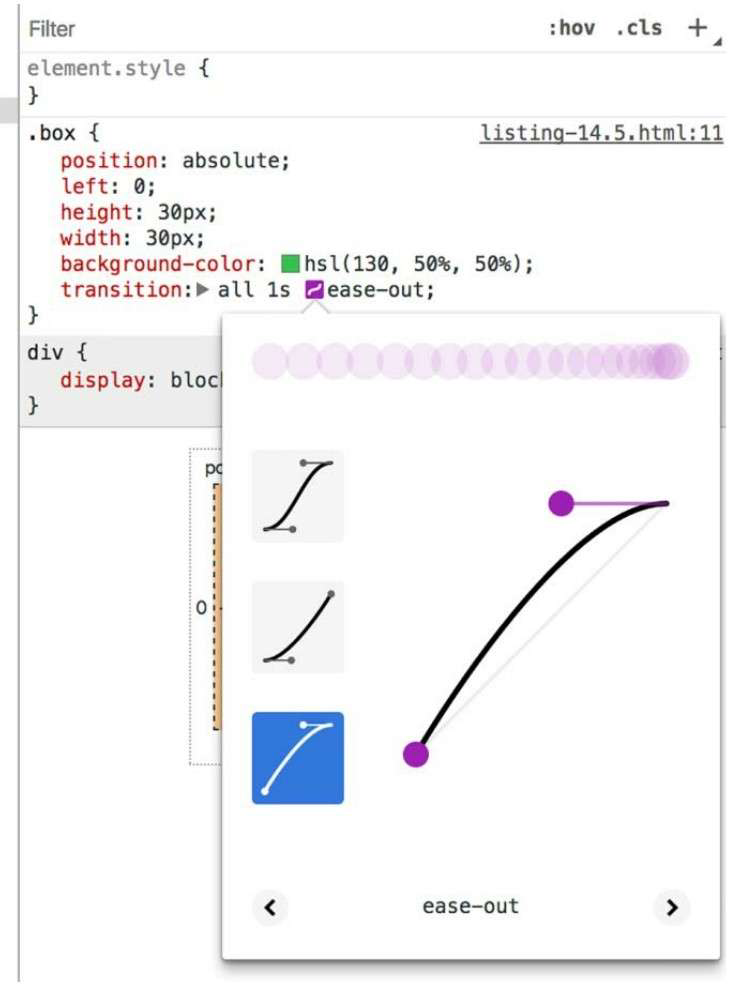

import { IframeWindow } from '@site/src/components/BrowserWindow';
import Tabs from '@theme/Tabs';
import TabItem from '@theme/TabItem';

# 十一、过渡

Web是个新鲜生动的媒介，可以做更多的事情，比如元素可以淡出、菜单可以滑入、颜色可以从一种变为另一种，实现这些效果最简单的方式是过渡。过渡可以增强页面的交互效果，而且因为我们的眼睛更容易被动态的东西吸引，所以当变化产生时可以更好地获得用户关注。

## 1. 过渡的基本用法

过渡是通过一系列transition-＊属性来实现的。如果某个元素设置了过渡，那么当它的属性值发生变化时，并不是直接变成新值，而是使用过渡效果。

例如下面这个按钮在鼠标悬浮时，不会马上变成悬浮的颜色和圆角。在这个过程中有一些中间状态。

<IframeWindow url="/css-tutorial/11-transition/transition-basic" />

代码如下所示。transition-property这个属性可以指定哪些属性使用过渡，关键字all意味着所有的属性变化都使用过渡；transition-duration属性代表过渡到最终值之前需要多长时间。

```html
<!doctype>
<head>
  <meta charset="UTF-8">
  <style type="text/css">
    button {
      background-color: hsl(180, 50%, 50%);
      border: 0;
      color: white;
      font-size: 1rem;
      padding: .3em 1em;
      transition-property: all;
      transition-duration: 0.5s;
    }
    button:hover {
      background-color: hsl(0, 50%, 50%);
      border-radius: 1em;
    }
  </style>
</head>
<body>
  <button>Hover over me</button>
</body>
</html>
```

也可以使用简写属性transition，该简写属性接受四个参数值，分别代表四个过渡属性：

- transition-property：设置了哪个属性需要过渡，初始值是关键字all，表示所有属性都生效。如果只有某个属性需要过渡，在这里指定属性即可。也可以设置多个属性值。
- transition-duration：持续时间，是一个用秒（例如1s）或者毫秒（1000ms）表示的时间值。
- transition-timing-function：定时函数，用来控制属性的中间值如何计算，实际上控制的是过渡过程中变化率如何加速或者减速。定时函数可以是一个关键字值，比如linear或者ease-in，也可以是自定义函数。
- transition-delay：延迟时间，允许在属性值改变之后过渡生效之前设置一个等待周期。

因此上述相关的css代码也可以像下面这样写：

```css
button {
  background-color: hsl(180, 50%, 50%);
  border: 0;
  color: white;
  font-size: 1rem;
  padding: .3em 1em;
  transition: border-radius 0.5s ease,
              background-color 1s linear;
}
button:hover {
  background-color: hsl(0, 50%, 50%);
  border-radius: 1em;
}
```

## 2. 定时函数

定时函数用来说明如何移动。是以恒定的速度移动吗？还是开始的时候慢，后面越来越快？

### 2.1 贝塞尔曲线

定时函数是基于数学定义的贝塞尔曲线（Bézier curve）。浏览器使用贝塞尔曲线作为随时间变化的函数，来计算某个属性的值。浏览器预设了几种定时函数的贝塞尔曲线作为关键字用作定时函数。

我们可以使用几个关键字值来描述移动过程，比如linear、ease-in和ease-out。效果分别如下图所示：

<IframeWindow url="/css-tutorial/11-transition/timing-function" />

- 使用linear过渡，值以固定的速度改变；
- 使用ease-in，变化速度开始时慢，然后一直加速，直到过渡完成；
- 使用ease-out，变化开始时快速变化，结束时比较慢。

代码如下所示：

```css
<!doctype>
<head>
  <meta charset="UTF-8">
  <style type="text/css">
    .container {
      position: relative;
      height: 30px;
      margin: 1em 1em 0 1em;
    }
    .box {
      position: absolute;
      left: 0;
      height: 30px;
      width: 30px;
      background-color: hsl(130, 50%, 50%);
    }
    .container:hover .box {
      left: calc(100% - 30px);
    }
    .linear {
      transition: all 1s linear;
    }
    .ease-in {
      transition: all 1s ease-in;
    }
    .ease-out {
      transition: all 1s ease-out;
    }
  </style>
</head>
<body>
  <div class="container">
    <div class="box linear"></div>
  </div>
  <div class="container">
    <div class="box ease-in"></div>
  </div>
  <div class="container">
    <div class="box ease-out"></div>
  </div>
</body>
</html>
```

然而，贝塞尔曲线不等同于五个关键字（linear、ease-in、ease-out、ease、ease-in-out）。

我们可以定义自己的三次贝塞尔曲线（ubic Bézier curve），实现更温和或者更强烈的过渡效果。打开浏览器开发者工具并检查小绿盒子元素。在样式面板（Chrome）中，会发现定时函数旁边有一个小小的标志符号。点击标志符号会打开一个弹窗，可以在弹窗中修改定时函数的曲线。



修改完毕后，`transition` 属性会替换成诸如`cubic-bezier(0.45, 0.05, 0.55, 0.95)` 的值。

我们很难通过这些数字想象出来曲线的具体样式，通常会先在浏览器中编辑、测试过渡效果。

### 2.2 阶跃

阶跃是另一种定时函数，即steps()函数。跟前面介绍的从一个值到另一个值的基于贝塞尔曲线的流畅过渡不同，这个函数是一系列非连续性的瞬时“阶跃”（steps）。效果如下图所示：

<IframeWindow url="/css-tutorial/11-transition/steps-function" />

阶跃函数需要两个参数：阶跃次数和一个用来表示每次变化发生在阶跃的开始还是结束的关键词（start或者end）。第二个参数的默认值是end，所以steps(3)可以用来代替steps(3, end)。代码如下所示：

```html
<!doctype>
<head>
  <meta charset="UTF-8">
  <style type="text/css">
    .container {
      position: relative;
      height: 30px;
      margin: 1em 1em 0 1em;
    }
    .box {
      position: absolute;
      left: 0;
      height: 30px;
      width: 30px;
      background-color: hsl(130, 50%, 50%);
      transition: all 1s steps(3);
    }
    .container:hover .box {
      left: calc(100% - 30px);
    }
  </style>
</head>
<body>
  <div class="container">
    <div class="box"></div>
  </div>
</body>
</html>
```

## 3. 与javascript结合的过渡

如果JavaScript修改了页面上的东西，你可能就需要考虑添加过渡是否合适。有些情况下比较简单，就和为元素添加过渡属性差不多，遇到复杂的情况就需要一些额外配置了。

### 3.1 淡入淡出

之前的过渡都比较简单。比如鼠标悬浮在元素上触发属性值的改变，这种通过伪类属性就能实现。接下来要实现一个下拉菜单，点击它出现过渡的效果，它是通过javascript切换类名来实现的。

<IframeWindow url="/css-tutorial/11-transition/menu-fade" />

实现的代码如下。需要注意以下几点：

1. **不是所有属性都可以添加动画效果，display属性就是其中之一。**可以在display: none和display: block之间切换，但不能在这两个值之间过渡，因此，任何应用到display上的过渡属性都会被忽略。
2. **实现元素的淡入淡出，需要使用opacity属性。**但问题是菜单关闭的时候并不会消失，只是完全透明了，仍然存在于页面上。这时候点击Read more链接，不会按照预期工作。
3. **visibility属性可以从页面上移除某个元素，visibility可以支持动画。**为它设置过渡不会使其逐渐消失，但transition-delay可以生效。
    1. 菜单淡出的时候。第一组值为opacity设置1s的过渡，第二组值为visibility设置0s的过渡（立即执行），但有1s的延迟。这就意味着先执行opacity的过渡，结束之后再执行visibility的过渡。这样就实现了菜单的缓慢淡出。
    2. 菜单淡入的时候。需要不同的顺序，这时候可见性需要立即触发，然后再执行透明度的过渡。这就是为什么我们在第二个规则集中把过渡延迟设置为0s。

```mdx-code-block
<Tabs>
<TabItem value="html" label="HTML">
```

```html
<!DOCTYPE >
<html lang="en">
  <head>
    <meta charset="utf-8" />
  </head>

  <body>
    <div class="dropdown" aria-haspopup="true">
      <button class="dropdown__toggle">Menu</button>
      <div class="dropdown__drawer">
        <ul class="menu" role="menu">
          <li role="menuitem">
            <a href="#">Features</a>
          </li>
          <li role="menuitem">
            <a href="#">Pricing</a>
          </li>
          <li role="menuitem">
            <a href="#">Support</a>
          </li>
          <li role="menuitem">
            <a href="#">About</a>
          </li>
        </ul>
      </div>
    </div>
    <p><a href="#">Read more</a></p>
  </body>
</html>
```

```mdx-code-block
</TabItem>
<TabItem value="css" label="CSS">
```

```css
body {
  font-family: Helvetica, Arial, sans-serif;
}

.dropdown__toggle {
  display: block;
  padding: 0.5em 1em;
  border: 1px solid hsl(280, 10%, 80%);
  color: hsl(280, 30%, 60%);
  background-color: white;
  font: inherit;
  text-decoration: none;
  transition: background-color 0.2s linear;
}
.dropdown__toggle:hover {
  background-color: hsl(280, 15%, 95%);
}
.dropdown__drawer {
  position: absolute;
  background-color: white;
  width: 10em;
  opacity: 0;
  visibility: hidden;
  transition: opacity 1s linear, 
              visibility 1s linear 1s;
}
.dropdown.is-open .dropdown__drawer {
  opacity: 1;
  visibility: visible;
  transition-delay: 0s;
}

.menu {
  padding-left: 0;
  margin: 0;
  list-style: none;
}
.menu > li + li > a {
  border-top: 0;
}
.menu > li > a {
  display: block;
  padding: 0.5em 1em;
  color: hsl(280, 40%, 60%);
  background-color: white;
  text-decoration: none;
  transition: all 0.2s linear;
  border: 1px solid hsl(280, 10%, 80%);
}
.menu > li > a:hover {
  background-color: hsl(280, 15%, 95%);
  color: hsl(280, 25%, 10%);
}
```

```mdx-code-block
</TabItem>
<TabItem value="js" label="JavaScript">
```

```js
var toggle = document.getElementsByClassName("dropdown__toggle")[0];
var dropdown = toggle.parentElement;
toggle.addEventListener("click", function (e) {
  e.preventDefault();
  dropdown.classList.toggle("is-open");
});
```

```mdx-code-block
</TabItem>
</Tabs>
```

### 3.2 过渡到自动高度

下拉菜单除了可以使用淡出淡入的过渡效果外，还可以使用另一种过渡效果。即通过高度的过渡来滑动打开和关闭菜单。这种效果如下图所示。

<IframeWindow url="/css-tutorial/11-transition/menu-autoHeight" />

代码如下所示。需要注意如下几点：

1. 设置overflow为hidden，是为了在关闭或者过渡过程中截断抽屉的内容。
2. 这里高度的过渡值必须是一个明确的高度，浏览器没法实现从0过渡到auto。因此需要通过javascript来访问DOM元素的scrollHeight属性，获取到高度值。然后就可以把元素的高度修改为获取到的值。

```mdx-code-block
<Tabs>
<TabItem value="html" label="HTML">
```

```html
<!DOCTYPE >
<html lang="en">
  <head>
    <meta charset="utf-8" />
  </head>
  <body>
    <div class="dropdown" aria-haspopup="true">
      <button class="dropdown__toggle">Menu</button>
      <div class="dropdown__drawer">
        <ul class="menu" role="menu">
          <li role="menuitem">
            <a href="#">Features</a>
          </li>
          <li role="menuitem">
            <a href="#">Pricing</a>
          </li>
          <li role="menuitem">
            <a href="#">Support</a>
          </li>
          <li role="menuitem">
            <a href="#">About</a>
          </li>
        </ul>
      </div>
    </div>
    <p><a href="#">Read more</a></p>
  </body>
</html>
```

```mdx-code-block
</TabItem>
<TabItem value="css" label="CSS">
```

```css
body {
  font-family: Helvetica, Arial, sans-serif;
}

.dropdown__toggle {
  display: block;
  padding: 0.5em 1em;
  border: 1px solid hsl(280, 10%, 80%);
  color: hsl(280, 30%, 60%);
  background-color: white;
  font: inherit;
  text-decoration: none;
  transition: background-color 0.2s linear;
}
.dropdown__toggle:hover {
  background-color: hsl(280, 15%, 95%);
}
.dropdown__drawer {
  position: absolute;
  background-color: white;
  width: 10em;
  height: 0;
  overflow: hidden;
  transition: height 0.3s ease-out;
}
.dropdown.is-open .dropdown__drawer {
  height: auto;
}

.menu {
  padding-left: 0;
  margin: 0;
  list-style: none;
}
.menu > li + li > a {
  border-top: 0;
}
.menu > li > a {
  display: block;
  padding: 0.5em 1em;
  color: hsl(280, 40%, 60%);
  background-color: white;
  text-decoration: none;
  transition: all 0.2s linear;
  border: 1px solid hsl(280, 10%, 80%);
}
.menu > li > a:hover {
  background-color: hsl(280, 15%, 95%);
  color: hsl(280, 25%, 10%);
}
```

```mdx-code-block
</TabItem>
<TabItem value="js" label="JavaScript">
```

```js
var toggle = document.getElementsByClassName("dropdown__toggle")[0];
var dropdown = toggle.parentElement;
var drawer = document.getElementsByClassName("dropdown__drawer")[0];
var height = drawer.scrollHeight;

toggle.addEventListener("click", function (e) {
  e.preventDefault();
  dropdown.classList.toggle("is-open");
  if (dropdown.classList.contains("is-open")) {
    drawer.style.setProperty("height", height + "px");
  } else {
    drawer.style.setProperty("height", "0");
  }
});
```

```mdx-code-block
</TabItem>
</Tabs>
```

有时候过渡需要CSS和JavaScript相互配合。某些情况下，整个逻辑都使用JavaScript实现可能更容易想到。但我们通常应该使用CSS去实现CSS可以做的那部分功能。因为浏览器对这部分已经做过优化，可以避免使用js造成的性能消耗。