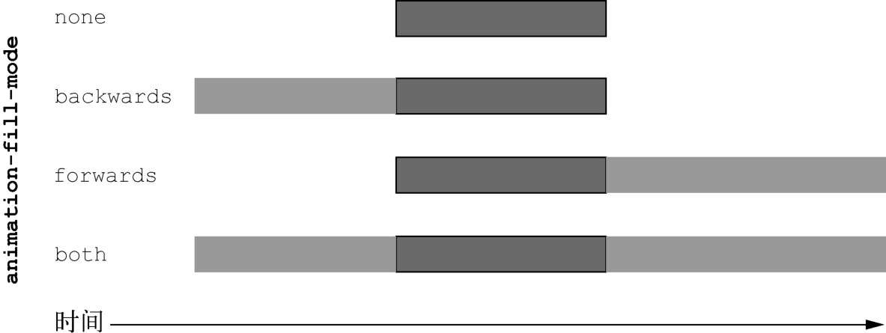

import { IframeWindow } from '@site/src/components/BrowserWindow';
import Tabs from '@theme/Tabs';
import TabItem from '@theme/TabItem';

# 十三：动画

过渡是直接从一个地方变换到另一个地方，相比之下，我们可能希望某个元素的变化过程是迂回的路径。这些事情无法使用过渡来实现。为了对页面变化有更加精确的控制，CSS提供了关键帧动画。

## 1. 关键帧

关键帧（keyframe）是指动画过程中某个特定时刻。我们定义一些关键帧，浏览器负责填充或者插入这些关键帧之间的帧图像。过渡可以看成只有第一帧（起始点）和最后一帧（结束点）的动画。

使用三个关键帧的效果如下所示。第一帧中元素是红色的；第二帧中元素是浅蓝色的，并且斜向下移动了100px；最后一帧中，元素是淡紫色的，并且回到了左侧的初始位置。

<IframeWindow url="/css-tutorial/13-animation/animation-basic" />

代码如下所示。animation属性有四个，这里使用了简写。

- **animation-name**（over-and-back）——代表动画名称，就像@keyframes规则定义的那样。
- **animation-duration**（1.5s）——代表动画持续时间，在本例中是1.5s。
- **animation-timing-function**（linear）——代表定时函数，用来描述动画如何加速和/或减速。可以是贝塞尔曲线或者关键字值，就像过渡使用的定时函数一样（ease-in、ease-out，等等）。
- **animation-iteration-count**（3）——代表动画重复的次数。初始值默认是1。

```html
<!doctype html>
<html lang="en">
<head>
  <style>
    .box {
      width: 50px;
      height: 50px;
      background-color: green;
      animation: over-and-back 2s linear 3;
    }

    @keyframes over-and-back {
      0% {
        background-color: hsl(0, 50%, 50%);
        transform: translate(0);
      }

      50% {
        transform: translate(100px, 100px);
      }

      100% {
        background-color: hsl(270, 50%, 90%);
        transform: translate(0);
      }
    }
  </style>
</head>
<body>
  <div class="box"></div>
</body>
</html>
```

定义关键帧动画有以下规则：

1. 关键帧动画都需要名称。使用百分比来定义关键帧。比如本例中动画被命名为over-and-back。三个关键帧一个在动画的开始（0%），一个在中间（50%），一个在终点（100%）。
2. 并不是每个关键帧都需要设置所有的两个属性。比如本例中第二个关键帧没有设置背景色，则在50%的位置背景色是0%和100%两个背景色的中间值

## 2. 为变换添加动画

动画和过渡一样，一般都是结合变换来创建一些酷炫的效果。比如像下面这样，为卡片添加3d变换动画，使其具有飞入效果。

<IframeWindow url="/css-tutorial/13-animation/animation-transform" />

代码如下所示，整个卡片区域采用网格布局。页面加载的时候，卡片会以绕纵轴旋转90度的起始状态，从远处出现。然后它们会飞向观察者，在动画接近结束的时候，转到直接朝向观察者。这个过程对应动画的三个关键帧。

```mdx-code-block
<Tabs>
<TabItem value="html" label="HTML">
```

```html
<head>
  <link href="https://fonts.googleapis.com/css?family=Alfa+Slab+One|Raleway" rel="stylesheet">
</head>
<body>
  <main class="flyin-grid">
    <div class="flyin-grid__item card">
      
      <h4>Red Panda</h4>
      <p>This animal is very cute!</p>
    </div>
    <div class="flyin-grid__item card">
      
      <h4>Giraffe</h4>
      <p>This animal is ver long!</p>
    </div>
    <div class="flyin-grid__item card">
      
      <h4>Tiger</h4>
      <p>This animal is a big cat!</p>
    </div>
    <div class="flyin-grid__item card">
      
      <h4>Cat</h4>
      <p>This animal is very lazy!</p>
    </div>
  </main>
</body>
```
    
```mdx-code-block
</TabItem>
<TabItem value="css" label="CSS">
```
    
```css
html {
  box-sizing: border-box;
}
*,
*::before,
*::after {
  box-sizing: inherit;
}

body {
  background-color: hsl(200, 80%, 30%);
  background-image: radial-gradient(hsl(200, 80%, 30%), hsl(210, 80%, 20%));
  color: white;
  font-family: Raleway, Helvetica, Arial, sans-serif;
  line-height: 1.4;
  margin: 0;
  min-height: 100vh;
}

h1, h2, h3 {
  font-family: Alfa Slab One, serif;
  font-weight: 400;
}

main {
  display: block;
}

img {
  max-width: 100%;
}

.flyin-grid {
  display: grid;
  margin: 0 1rem;
  perspective: 500px;
  grid-template-columns: repeat(auto-fit, minmax(200px, 1fr));
  grid-gap: 1em;
}

.flyin-grid__item {
  max-width: initial;
  margin: 0;
  animation: fly-in 600ms ease-in;
  animation-fill-mode: backwards;
}

.flyin-grid__item:nth-child(2) {
  animation-delay: 0.15s;
}
.flyin-grid__item:nth-child(3) {
  animation-delay: 0.3s;
}
.flyin-grid__item:nth-child(4) {
  animation-delay: 0.45s;
}

.card {
  margin-bottom: 1em;
  padding: 0.5em;
  background-color: white;
  color: hsl(210, 15%, 20%);
  box-shadow: 0.2em 0.5em 1em rgba(0, 0, 0, 0.3);
}
.card > img {
  width: 100%;
}

@keyframes fly-in {
  0% {
    transform: translateZ(-800px) rotateY(90deg);
    opacity: 0;
  }
  56% {
    transform: translateZ(-160px) rotateY(87deg);
    opacity: 1;
  }
  100% {
    transform: translateZ(0) rotateY(0);
  }
}
```

```mdx-code-block
</TabItem>
</Tabs>
```

需要注意的是，对于每个卡片添加了不同的animation-delay属性。利用这个属性，可以设置动画交错发生。但是只这样做是不够的。

因为transform和opacity属性只应用在了动画执行期间。动画开始之前，网格元素在页面上是可见的，就在它们各自的正常位置。动画开始的时候，它们瞬间变成0%关键帧上应用的属性值。显然这样看起来很怪。

可以使用`animation-fill-mode`属性来解决这个问题，把动画样式后向填充设置，就像一直暂停在第一帧，直到动画开始播放。

`animation-fill-mode: none`，意思是动画执行前或执行后动画样式都不会应用到元素上；

`animation-fill-mode: backwards`，在动画执行之前，浏览器就会取出动画中第一帧的值，并把它们应用在元素上；

`animation-fill-mode: forwards` ，会在动画播放完成后仍然应用最后一帧的值；

`animation-fill-mode:` both ，会同时向前和向后填充。



## 3. 动画的作用

人们对动画有个普遍误解，即它们只是用来让页面变得有趣，没有什么实际用处。实际上动画有以下两个非常重要的作用：

1. **反馈用户操作**。动画可以向用户表明按钮被点击了或者消息被接收了。对于表单的按钮而言，在点击后给一个loading的动画是非常有必要的。
2. **吸引用户的注意力**。动画也可以用来把用户的注意力吸引到某些地方。对于要输入很多内容的文本框而言，在用户停止输入后使用动画快速摇动按钮，就可以提示他们保存输入的内容。

具体效果如下所示：

<IframeWindow url="/css-tutorial/13-animation/animation-usage" />

代码如下所示。分别添加了两个类：`.is-loading` 和`.shake` 。这两个类中分别定义了loading动画和shake动画。借助javascript可以在点击保存按钮时切换`.is-loading` 类、在停止文本输入时切换`.shake` 类，来触发对应的动画。

```mdx-code-block
<Tabs>
<TabItem value="html" label="HTML">
```

```html
<body>
  <form>
    <label for="trip">Please input your opinion:</label>
    <textarea id="trip" name="about-my-trip" rows="5"></textarea>
    <button type="submit" id="submit-button">Save</button>
  </form>
</body>
```
    
```mdx-code-block
</TabItem>
<TabItem value="css" label="CSS">
```
    
```css
body {
  font-family: Helvetica, Arial, sans-serif;
}

form {
  max-width: 500px;
}

label,
textarea {
  display: block;
  margin-bottom: 1em;
}

textarea {
  width: 100%;
  font-size: inherit;
}

button {
  padding: 0.6em 1em;
  border: 0;
  background-color: hsl(220, 50%, 50%);
  color: white;
  font: inherit;
  transition: background-color 0.3s linear;
}
button:hover {
  background-color: hsl(220, 45%, 40%);
}

button.is-loading {
  position: relative;
  color: transparent;
}
button.is-loading::after {
  position: absolute;
  content: "";
  display: block;
  width: 1.4em;
  height: 1.4em;
  top: 50%;
  left: 50%;
  margin-left: -0.7em;
  margin-top: -0.7em;
  border-top: 2px solid white;
  border-radius: 50%;
  animation: spin 0.5s linear infinite;
}

.shake {
  animation: shake 0.7s linear;
}

@keyframes spin {
  0% {
    transform: rotate(0deg);
  }
  100% {
    transform: rotate(360deg);
  }
}

@keyframes shake {
  0%,
  100% {
    transform: translateX(0);
  }
  10%,
  30%,
  50%,
  70% {
    transform: translateX(-0.4em);
  }
  20%,
  40%,
  60% {
    transform: translateX(0.4em);
  }
  80% {
    transform: translateX(0.3em);
  }
  90% {
    transform: translateX(-0.3em);
  }
}
```
    
```mdx-code-block
</TabItem>
<TabItem value="js" label="JavaScript">
```

```js
var input = document.getElementById('trip');
var button = document.getElementById('submit-button');

var timeout = null;

button.addEventListener('click', function(event) {
  event.preventDefault();
  clearTimeout(timeout);
  button.classList.add('is-loading');
  button.disabled = true;
  input.disabled = true;
});

input.addEventListener('keyup', function() {
  clearTimeout(timeout);
  timeout = setTimeout(function() {
    button.classList.add('shake');
  }, 1000);
});
button.addEventListener('animationend', function() {
  button.classList.remove('shake');
});
```

```mdx-code-block
</TabItem>
</Tabs>
```