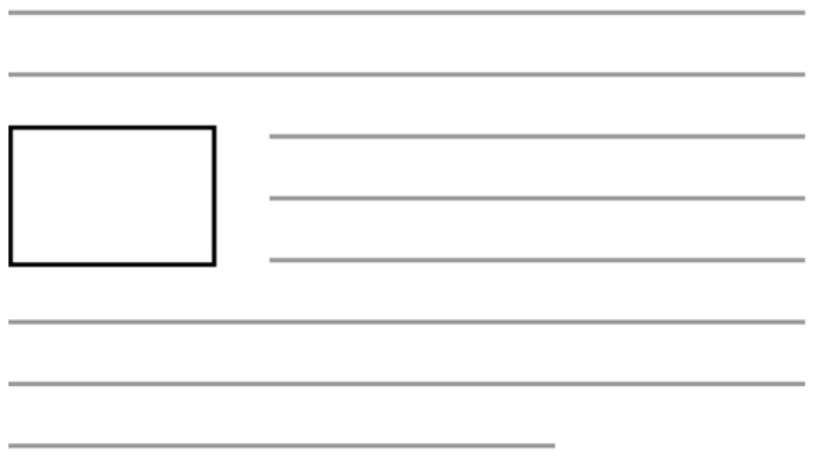
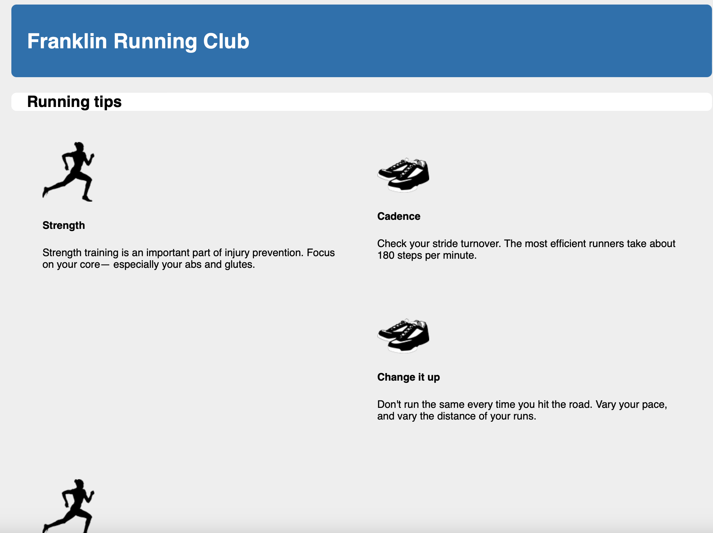
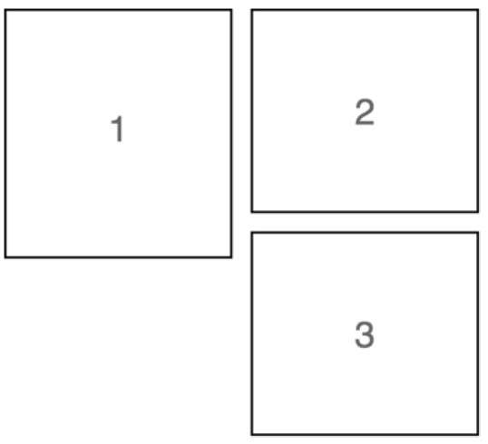
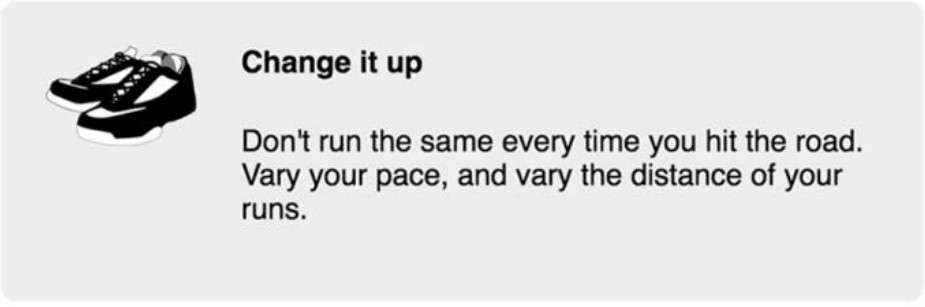
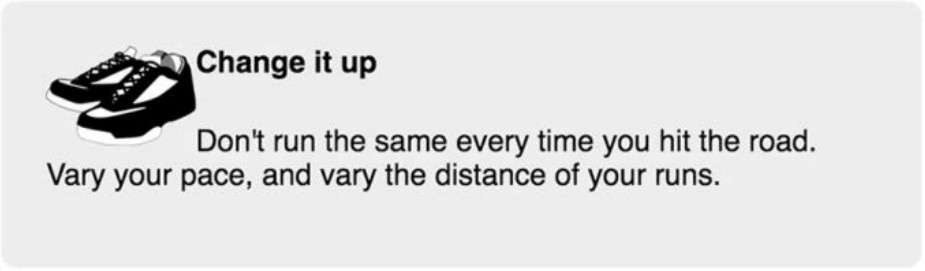
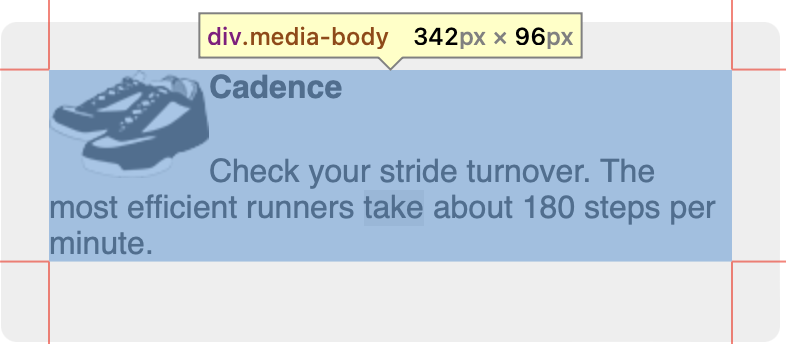
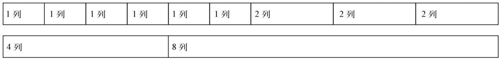

# 四、浮动

## 1 浮动设计的初衷

浮动的初衷是为了实现图文混排的效果。通过将某个元素设置为浮动，可以让它脱离文档流，从而实现文字环绕的效果。



最初创造浮动不是为了页面布局。现在常用的flexbox布局和网格布局在css早期都是没有的，因此当时浮动充当了布局的作用。如今采用浮动来进行布局显然不是一个很好的选择，除非是为了兼容老旧的浏览器。

## 2 理解浮动的机制

浮动的初衷是为了实现图文混排，如果不理解浮动的机制就采用浮动进行布局，可能会产生意想不到的bug。

```html
<!doctype html>
<head>
  <style>
    :root {
      box-sizing: border-box;
    }

    *,
    ::before,
    ::after {
      box-sizing: inherit;
    }

    body {
      background-color: #eee;
      font-family: Helvetica, Arial, sans-serif;
    }

    body * + * {
      margin-top: 1.5em;
    }

    header {
      padding: 1em 1.5em;
      color: #fff;
      background-color: #0072b0;
      border-radius: .5em;
      margin-bottom: 1.5em;
    }

    .main {
      padding: 0 1.5em;
      background-color: #fff;
      border-radius: .5em;
    }

    .container {
      max-width: 1080px;
      margin: 0 auto;
    }

    .media {
      float: left;
      width: 50%;
      padding: 1.5em;
      background-color: #eee;
      border-radius: 0.5em;
    }
  </style>
</head>

<body>
  <div class="container">
    <header>
      <h1>Franklin Running Club</h1>
    </header>

    <main class="main clearfix">
      <h2>Running tips</h2>

      <div>
        <div class="media">
          
          <div class="media-body">
            <h4>Strength</h4>
            <p>
              Strength training is an important part of
              injury prevention. Focus on your core&mdash;
              especially your abs and glutes.
            </p>
          </div>
        </div>

        <div class="media">
          
          <div class="media-body">
            <h4>Cadence</h4>
            <p>
              Check your stride turnover. The most efficient
              runners take about 180 steps per minute.
            </p>
          </div>
        </div>

        <div class="media">
          
          <div class="media-body">
            <h4>Change it up</h4>
            <p>
              Don't run the same every time you hit the
              road. Vary your pace, and vary the distance
              of your runs.
            </p>
          </div>
        </div>

        <div class="media">
          
          <div class="media-body">
            <h4>Focus on form</h4>
            <p>
              Run tall but relaxed. Your feet should hit
              the ground beneath your hips, not out in
              front of you.
            </p>
          </div>
        </div>
      </div>
    </main>
  </div>
</body>
```

比如上面这段代码，分为上下两个部分。上面部分是蓝色背景的大标题，下面部分是白色背景的商品展示。

为了使每个商品占据50%的宽度依次排列，对商品展示区域media采用了浮动布局。

最终效果如下所示，使用浮动布局后出现了两个明显的问题：白色背景区域main没有将四个商品展示区域media包含进去；第三个media做边空出了一大块并导致了第四个media换行了。



以上两个问题是由浮动的机制导致的

### 2.1 清除浮动

第一个问题产生的原因是：浮动元素不同于普通文档流的元素，它们的高度不会加到父元素上。

在main元素里，除了页面小标题，其他元素都设置了浮动，所以容器的高度只包含页面标题的高度，浮动的媒体元素则扩展到主元素的白色背景下面。这种行为并不是我们想要的，主元素应该向下扩展到包含灰色的盒子。

**解决方案一：**

使用跟浮动配套的clear属性。将一个元素放在主容器的末尾，并对它使用clear，这会让容器扩展到浮动元素下面。代码如下所示：

```html
<body>
  <div class="container">
    <!-- others -->
    <main class="main clearfix">
      <!-- others -->
      <div style="clear: both"></div>
    </main>
  </div>
</body>
```

`clear: both`声明让该元素移动到浮动元素的下面，而不是侧面。clear的值还可以设置为left或者right，这样只会相应地清除向左或者向右浮动的元素。因为空div本身没有浮动，所以容器就会扩展，直到包含它，因此也会包含该div上面的浮动元素。

**解决方案二：**

用伪元素（pseudo-element）来实现。使用`:after`伪元素选择器，就可以快速地在DOM中在容器末尾添加一个元素，而不用在HTML里添加标记。

```css
.clearfix::after {
  display: block;
  content: " ";
  clear: both;
}
```

第一种方案要在html中添加不必要的标记，因此这种使用纯css的方案更实用。

### 2.2 浮动陷阱

第二个问题产生的原因是：浏览器会将浮动元素尽可能地放在靠上的地方。可以参考下图进行理解



这种行为本质上取决于每个浮动块的高度。在如果盒子2比盒子1矮，盒子3就没法抓住盒子1的下边缘。从而会导致空出一块区域，后面的盒子会因此换行。

**解决方案：**

清除每行的第一个元素上面的浮动。因为这个例子中每行只有两个元素，因此可以使用如下css样式：

```css
.media {
  float: left;
  width: 50%;
  padding: 1.5em;
  background-color: #eee;
  border-radius: 0.5em;
}

.media:nth-child(odd) {
  clear: left;
}
```

## 3 BFC

### 3.1 脱离文档流

接下来继续使用浮动将商品展示内容按照左右两列进行布局，期待效果如下所示：



相应的代码如下：

```html
<div class="media">
  
  <div class="media-body">
    <h4>Change it up</h4>
    <p>
      Don't run the same every time you hit the
      road. Vary your pace, and vary the distance
      of your runs.
    </p>
  </div>
</div>
```

```css
.media-image {
  float: left;
}

.media-body {
  margin-top: 0;
}

.media-body h4 {
  margin-top: 0;
}
```

实际效果如下。很显然这种图文混排的效果就是浮动的本质，但并不是我们想要的效果。



在浏览器中可以发现右边区域（media-body）实际上扩展到了最左边，它包围了浮动的图片。浮动图片是脱离文档流的



### 3.2 BFC

现在文字围绕着图片，但是只要清除了图片底部的浮动，正文就会立刻移动到媒体盒子的左边。

为了实现预期效果的布局，需要为正文建立一个块级格式化上下文（block formatting context, BFC）。BFC里的内容不会跟外部的元素重叠或者相互影响。如果给元素增加clear属性，它只会清除自身所在BFC内的浮动。如果强制给一个元素生成一个新的BFC，它不会跟其他BFC重叠。

给元素添加以下的任意属性值都会创建BFC。

- float: left或right，不为none即可。
- overflow:hidden、auto或scroll，不为visible即可。
- display:inline-block、table-cell、table-caption、flex、inline-flex、grid或inline-grid。拥有这些属性的元素称为块级容器（block container）。
- position:absolute或position: fixed

因此进行如下修改就能实现预期效果。

```css
.media-image {
  float: left;
  margin-right: 1.5em;
}

.media-body {
  overflow: auto;
  margin-top: 0;
}

.media-body h4 {
  margin-top: 0;
}
```

## 4 网格系统

大部分流行的CSS框架包含了自己的网格系统。它们的实现细节各不相同，但是设计思想相同：在一个行容器里放置一个或多个列容器。列容器的类决定每列的宽度。

### 4.1 理解网格系统

通常网格系统的每行被划分为特定数量的列，一般是12个。选取12作为列数是因为它能够被2、3、4、6整除，组合起来足够灵活。



### 4.2 构建网格系统

网格系统的相关样式如下所示。定义了12个类`.column-*`分别代表占据列数的12个情况。然后用属性选择器`[class*="column-"]` 选中这12个类，通过设置padding来定义网格每列之间的间隔。在给每行`.row` 添加左右负外边距来抵消首位两个列元素的padding。

```css
.row {
  margin-left: -0.75em;
  margin-right: -0.75em;
}

.row::after {
  content: " ";
  display: block;
  clear: both;
}

[class*="column-"] {
  float: left;
  padding: 0 0.75em;
  margin-top: 0;
}

.column-1 { width: 8.3333%; }
.column-2 { width: 16.6667%; }
.column-3 { width: 25%; }
.column-4 { width: 33.3333%; }
.column-5 { width: 41.6667%; }
.column-6 { width: 50%; }
.column-7 { width: 58.3333%; }
.column-8 { width: 66.6667%; }
.column-9 { width: 75%; }
.column-10 { width: 83.3333%; }
.column-11 { width: 91.6667% }
.column-12 { width: 100%; }
```

在html使用类似下面的代码即可实现基于浮动的网格系统

```html
<main class="main clearfix">
  <h2>Running tips</h2>

  <div class="row">
    <div class="column-6">
      <div class="media">
        
        <div class="media-body">
          <h4>Strength</h4>
          <p>
            Strength training is an important part of
            injury prevention. Focus on your core&mdash;
            especially your abs and glutes.
          </p>
        </div>
      </div>
    </div>

    <div class="column-6">
      <div class="media">
        
        <div class="media-body">
          <h4>Cadence</h4>
          <p>
            Check your stride turnover. The most efficient
            runners take about 180 steps per minute.
          </p>
        </div>
      </div>
    </div>
  </div>

  <div class="row">
    <div class="column-6">
      <div class="media">
        
        <div class="media-body">
          <h4>Change it up</h4>
          <p>
            Don't run the same every time you hit the
            road. Vary your pace, and vary the distance
            of your runs.
          </p>
        </div>
      </div>
    </div>

    <div class="column-6">
      <div class="media">
        
        <div class="media-body">
          <h4>Focus on form</h4>
          <p>
            Run tall but relaxed. Your feet should hit
            the ground beneath your hips, not out in
            front of you.
          </p>
        </div>
      </div>
    </div>
  </div>
</main>
```