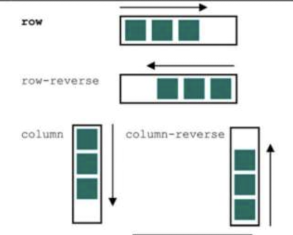
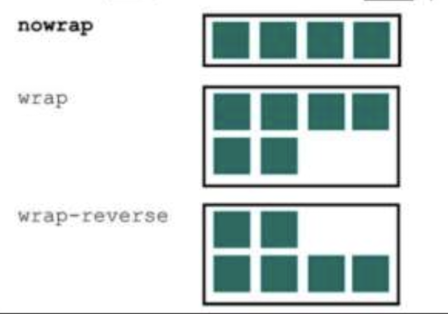

import BrowserWindow from '@site/src/components/BrowserWindow';
import Tabs from '@theme/Tabs';
import TabItem from '@theme/TabItem';

# 五、FlexBox

## 1. FlexBox的原则

### 1.1 基本概念

弹性子元素默认是在同一行按照从左到右的顺序并排排列。

弹性容器像块元素一样填满可用宽度，但是弹性子元素不一定填满其弹性容器的宽度。弹性子元素高度相等，该高度由它们的内容决定（即内容最长的元素高度那个作为统一高度）。

子元素按照主轴线排列，主轴的方向为主起点（左）到主终点（右）。垂直于主轴的是副轴。方向从副起点（上）到副终点（下）。这些轴的方向可以改变。

### 1.2 创建FlexBox布局

使用flex布局可以很方便的创建一个菜单，菜单的html和css代码如下：

```mdx-code-block
<Tabs>
<TabItem value="js" label="HTML">
```

```html
<nav>
  <ul class="site-nav">
    <li><a href="/">Home</a></li>
    <li><a href="/features">Features</a></li>
    <li><a href="/pricing">Pricing</a></li>
    <li><a href="/support">Support</a></li>
    <li class="nav-right">
      <a href="/about">About</a>
    </li>
  </ul>
</nav>
```

```mdx-code-block
</TabItem>
<TabItem value="css" label="CSS">
```

```css
.site-nav {
  display: flex;
  padding: .5em;
  background-color: #5f4b44;
  list-style-type: none;
  border-radius: .2em;
}

.site-nav > li {
  margin-top: 0;
}

.site-nav > li > a {
  display: block;
  padding: .5em 1em;
  background-color: #cc6b5a;
  color: white;
  text-decoration: none;
}

.site-nav > li + li {
  margin-left: 1.5em;
}

.site-nav > .nav-right {
  margin-left: auto;
}
```

```mdx-code-block
</TabItem>
</Tabs>
```

需要进行弹性布局排列的元素是li，因此只需要给父元素ul设置为`display: flex` ，所有的字元素li将会默认从左到右进行排列。

可以使用margin-left来给每个li元素设置间隔。最后一个li元素使用了`margin-left: auto` ，这时它将自动与最右边对齐，这个小技巧很实用。

最终效果图如下所示：

<BrowserWindow>


</BrowserWindow>

## 2. 弹性子元素的大小

flex属性控制弹性子元素在主轴方向上的大小。它是三个不同大小属性的简写：flex-grow、flex-shrink和flex-basis。

### 2.1 flex-basis

flex-basis定义了元素大小的基准值，即一个初始的“主尺寸”。flex-basis属性可以设置为任意的width值，包括px、em、百分比。它的初始值是auto，此时浏览器会检查元素是否设置了width属性值。如果有，则使用width的值作为flex-basis的值；如果没有，则用元素内容自身的大小。如果flex-basis的值不是auto, width属性会被忽略。


### 2.2 flex-grow

每个弹性子元素的flex-basis值计算出来后，它们（加上子元素之间的外边距）加起来会占据一定的宽度。加起来的宽度不一定正好填满弹性容器的宽度，可能会有留白。

多出来的留白（或剩余宽度）会按照flex-grow（增长因子）的值分配给每个弹性子元素，flex-grow的值为非负整数。


### 2.3 flex-shrink

每个子元素的flex-shrink值代表了它是否应该收缩以防止溢出。flex-shrink属性与flex-grow遵循相似的原则。计算出弹性子元素的初始主尺寸后，它们的累加值可能会超出弹性容器的可用宽度。如果不用flex-shrink，就会导致溢出


### 2.4 如何使用

推荐使用简写属性flex，而不是分别声明flex-grow、flex-shrink、flex-basis。与大部分简写属性不一样，如果在flex中忽略某个子属性，那么子属性的值并不会被置为初始值。相反，如果某个子属性被省略，那么flex简写属性会给出有用的默认值：flex-grow为1、flex-shrink为1、flex-basis为0%。这些默认值正是大多数情况下所需要的值。


## 3. 弹性方向

Flexbox的另一个重要功能是能够切换主副轴方向，用弹性容器的flex-direction属性控制。如前面的例子所示，它的初始值（row）控制子元素按从左到右的方向排列；


### 3.1 什么情况下使用垂直排列

对于div这种块状元素来说，本身就会占据一行，貌似没有垂直排列的必要。但是对于一个使用flex进行左右布局后，左右区域里的div元素上下排列的最终效果可能会出乎意料。

下面的代码要实现左右排列、并且右边区域的div元素使用默认形式垂直排列。

```mdx-code-block
<Tabs>
<TabItem value="js" label="HTML">
```

```html
<main class="flex">
  <div class="column-main tile">
    <h1>Team collaboration done right</h1>
    <p>Thousands of teams from all over the
      world turn to <b>Ink</b> to communicate
      and get things done.</p>
    <h1>Communication around the globe</h1>
    <p>Thousands of teams from all over the
      world turn to <b>Ink</b> to communicate
      and get things done.</p>
    <h1>Instant access to your team's documents</h1>
    <p>Thousands of teams from all over the
      world turn to <b>Ink</b> to communicate
      and get things done.</p>
    <h1>Intuitive interface</h1>
    <p>Thousands of teams from all over the
      world turn to <b>Ink</b> to communicate
      and get things done.</p>
  </div>
  <div class="column-sidebar">
    <div class="tile">
      <form class="login-form">
        <h3>Login</h3>
        <p>
          <label for="username">Username</label>
          <input id="username" type="text"
            name="username"/>
        </p>
        <p>
          <label for="password">Password</label>
          <input id="password" type="password"
            name="password"/>
        </p>
        <button type="submit">Login</button>
      </form>
    </div>
    <div class="tile centered">
      <small>Starting at</small>
      <div class="cost">
        <span class="cost-currency">$</span>
        <span class="cost-dollars">20</span>
        <span class="cost-cents">.00</span>
      </div>
      <a class="cta-button" href="/pricing">
        Sign up
      </a>
    </div>
  </div>
</main>
```

```mdx-code-block
</TabItem>
<TabItem value="css" label="CSS">
```

```css
.tile {
  padding: 1.5em;
  background-color: #fff;
}

.flex {
  display: flex;
}

.flex > * + * {
  margin-top: 0;
  margin-left: 1.5em;
}

.column-main {
  flex: 66.67%;
}

.column-sidebar {
  flex: 33.33%;
}
```

```mdx-code-block
</TabItem>
</Tabs>
```

最终效果如下所示。按照flex的原则，左右区域的高度应该是相等的。实际上，确实是相等的，只是右边区域里的内容没有填满这个高度。为了解决这个问题，可以对右边区进行flex垂直布局。

<BrowserWindow>


</BrowserWindow>

对上书css样式作如下修改，对右边区域做flex垂直布局，并设置每个字元素的flex-grow为1，这样两个子元素会均分最大高度。

```css
.tile {
  padding: 1.5em;
  background-color: #fff;
}

.flex {
  display: flex;
}

.flex > * + * {
  margin-top: 0;
  margin-left: 1.5em;
}

.column-main {
  flex: 2;
}

.column-sidebar {
  flex: 1;
  display: flex;
  flex-direction: column;
}

.column-sidebar > .tile {
  flex: 1;
}
```

## 4. FlexBox的属性

### 4.1 FlexBox的其余属性

**flex-wrap**

flex-wrap属性允许弹性子元素换到新的一行或多行显示。它可以设置为nowrap（初始值）、wrap或者wrap-reverse。启用换行后，子元素不再根据flex-shrink值收缩，任何超过弹性容器的子元素都会换行显示。

**justify-content**

当子元素未填满容器时，justify-content属性控制子元素沿主轴方向的间距。它的值包括几个关键字：flex-start、flex-end、center、space-between以及space-around。

**align-item**

justify-content控制子元素在主轴方向的对齐方式，align-items则控制子元素在副轴方向的对齐方式。align-items的初始值为stretch，在水平排列的情况下让所有子元素填充容器的高度，在垂直排列的情况下让子元素填充容器的宽度，因此它能实现等高列。

**align-content**

如果开启了换行（用flex-wrap）, align-content属性就可以控制弹性容器内沿副轴方向每行之间的间距。它支持的值有flex-start、flex-end、center、stretch（初始值）、space-between以及space-around。

### 4.2 弹性子元素的属性

这些元素是作用于子元素的，包括flex-grow、flex-shrink、flex-basis以及它们的简写属性flex、align-self和order。

**align-self**

该属性控制弹性子元素沿着容器副轴方向的对齐方式。它跟弹性容器的align-items属性效果相同，但是它能单独给弹性子元素设定不同的对齐方式。auto为初始值，会以容器的align-items值为准。其他值会覆盖容器的设置。

**order**

正常情况下，弹性子元素按照在HTML源码中出现的顺序排列。它们沿着主轴方向，从主轴的起点开始排列。使用order属性能改变子元素排列的顺序。还可以将其指定为任意正负整数。如果多个弹性子元素有一样的值，它们就会按照源码顺序出现。基本不会使用order！

## 5. 总结

FlexBox是css的一大进步，也是非常适合用来布局的。关于FlexBox的属性图解总结如下：

| 属性 | 概念 | 图解 |
| --- | --- | --- | 
| flex-direction | 指定了主轴方向，副轴垂直于主轴 | |
| flex-wrap | 指定了弹性子元素是否会在弹性容器内折行显示 | |
| flex-flow | flex-direction flex-wrap的简写 |
| justify-content | 控制子元素在主轴上的位置 | |
| align-items | 控制子元素在副轴上的位置 | |
| align-content | 如果开启了flex-wrap, align-content就会控制弹性子元素在副轴上的间距。如果子元素没有换行，就会忽略align-content | |
| align-items | 控制子元素在副轴上的位置 | |
| --- | --- | --- | 
| flex-grow | 整数，指定增长因子，决定子元素在主轴方向扩展的大小，填充未使用的空间 | |
| flex-shrink | 整数，指定收缩因子，决定子元素在主轴方向收缩的大小，防止溢出。开启了flex-wrap则会忽略该属性  | |
| flex-basis | 指定子元素未受flex-grow或flex-shrink影响时的初始大小 | |
| flex | flex-grow flex-shrink flex-basis的简写 | |
| align-self | 控制子元素在副轴上的对齐方式。它会覆盖容器上的align-items。如果子元素副轴方向上的外边距为auto，则会忽略该属性 | |
| order | 整数，将弹性子元素从兄弟节点中移动到指定位置，覆盖源码顺序 | |
