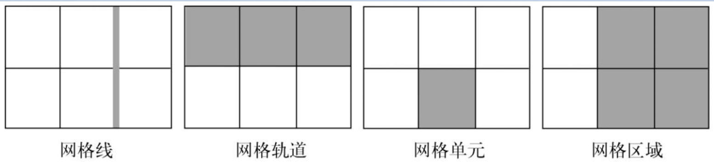
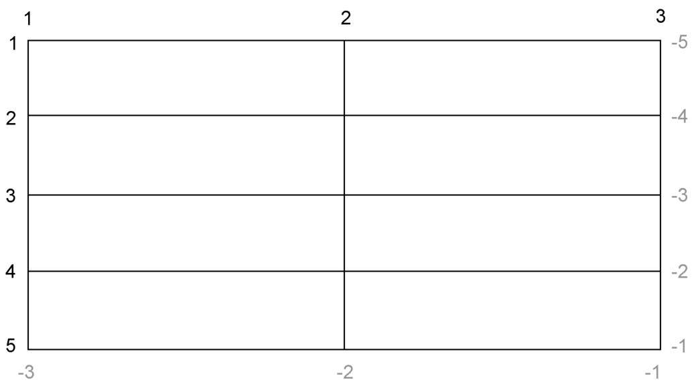
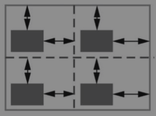
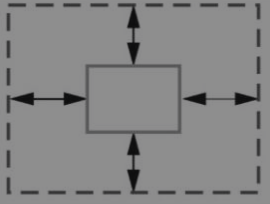
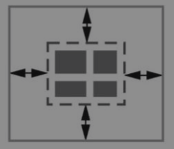

import BrowserWindow from '@site/src/components/BrowserWindow';
import Tabs from '@theme/Tabs';
import TabItem from '@theme/TabItem';

# 六、网格布局

网格布局是一种用于网页布局的CSS技术，它可以将页面分为多个网格区域，然后通过将元素放置在这些区域中来创建页面布局。网格布局可以用于创建复杂的多列布局，也可以用于简单的单列布局。

## 6.1 网格的概念

### 6.1.1 构建基础网格

<BrowserWindow>

<style>
  {`
    .grid {
      display: grid;
      grid-template-columns: 1fr 1fr 1fr;
      grid-template-rows: 1fr 1fr;
      grid-gap: 0.5em;
    }

    .grid > * {
      background-color: darkgray;
      color: white;
      padding: 2em;
      border-radius: 0.5em;
    }
  `}
</style>

<div class="grid">
  <div class="a">a</div>
  <div class="b">b</div>
  <div class="c">c</div>
  <div class="d">d</div>
  <div class="e">e</div>
  <div class="f">f</div>
</div>

</BrowserWindow>

构建一个如上图所示的基础网格布局的代码如下:

```html
<!doctype html>
<head>
  <style>
  .grid {
    display: grid;
    grid-template-columns: 1fr 1fr 1fr;
    grid-template-rows: 1fr 1fr;
    grid-gap: 0.5em;
  }

  .grid > * {
    background-color: darkgray;
    color: white;
    padding: 2em;
    border-radius: 0.5em;
  }
  </style>
</head>
<body>
  <div class="grid">
    <div class="a">a</div>
    <div class="b">b</div>
    <div class="c">c</div>
    <div class="d">d</div>
    <div class="e">e</div>
    <div class="f">f</div>
  </div>
</body>
```

跟Flexbox类似，网格布局也是作用于两级的DOM结构。设置为`display:grid`的元素成为一个网格容器（grid container）。它的子元素则变成网格元素（grid items）。

`grid-template-columns`和`grid-template-rows`。这两个属性定义了网格每行每列的大小。`fr`代表每一列（或每一行）的分数单位（fraction unit），这个单位跟Flexbox中flex-grow因子的表现一样。不一定非得用分数单位，可以使用其他的单位，比如px、em或百分数。也可以混搭这几种单位。

grid-gap属性定义了每个网格单元之间的间距。也可以用两个值分别指定垂直和水平方向的间距（比如grid-gap: 0.5em 1em）。

### 6.2 网格元素



- 网格线（grid line）——网格线构成了网格的框架。一条网格线可以水平或垂直，也可以位于一行或一列的任意一侧。如果指定了grid-gap的话，它就位于网格线上。
- 网格轨道（grid track）——一个网格轨道是两条相邻网格线之间的空间。网格有水平轨道（行）和垂直轨道（列）。
- 网格单元（grid cell）——网格上的单个空间，水平和垂直的网格轨道交叉重叠的部分。
- 网格区域（grid area）——网格上的矩形区域，由一个到多个网格单元组成。该区域位于两条垂直网格线和两条水平网格线之间。

### 6.1.3 Grid与Flexbox的区别

它们二者是互补的。虽然它们的功能有一些重叠的地方，但是它们各自擅长的场景不一样。这两种布局方式有以下两个重要区别：

- Flexbox本质上是一维的，而网格是二维的。
- Flexbox是以内容为切入点由内向外工作的，而网格是以布局为切入点从外向内工作的。

因为Flexbox是一维的，所以它很适合用在相似的元素组成的行（或列）上。它支持用flex-wrap换行，但是没法让上一行元素跟下一行元素对齐。相反，网格是二维的，旨在解决一个轨道的元素跟另一个轨道的元素对齐的问题。

## 6.2 网格布局的三种语法

网格布局的语法有三种：编号网格线、命名网格线和命名网格区域。接下来将使用这三种语法来实现如下图所示的网格布局。

<BrowserWindow>

<style>
{`
  .container-grid {
    display: grid;
    grid-template-columns: 2fr 1fr;
    grid-template-rows: repeat(4, auto);
    grid-gap: 1.5em;
    max-width: 1080px;
    margin: 0 auto;
  }

  .container-header,
  .container-nav {
    grid-column: 1 / 3;
    grid-row: span 1;
    background-color: #709b90;
    padding: 1.5em;
    color: #fff
  }

  .main {
    grid-column: 1 / 2;
    grid-row: 3 / 5;
  }

  .sidebar-top {
    grid-column: 2 / 3;
    grid-row: 3 / 4;
  }

  .sidebar-bottom {
    grid-column: 2 / 3;
    grid-row: 4 / 5;
  }

  .tile {
    padding: 1.5em;
    background-color: #709b90;
    color: #fff
  }

  .tile > :first-child {
    margin-top: 0;
  }

  .tile * + * {
    margin-top: 1.5em;
  }
`}
</style>

<div class="container-grid">
  <header class="container-header">
    <h1>头部</h1>
  </header>
  <nav class="container-nav">
    导航
  </nav>
  <main class="main tile">
    主要区域
  </main>
  <div class="sidebar-top tile">
    右侧上方区域
  </div>
  <div class="sidebar-bottom tile centered">
    右侧下方区域
  </div>
</div>

</BrowserWindow>

### 6.2.1 编号网格线

使用编号网格线实现如上图所示的代码如下：

```mdx-code-block
<Tabs>
<TabItem value="js" label="JavaScript">
```

```html
<div class="container-grid">
  <header class="container-header">
    <h1>头部</h1>
  </header>
  <nav class="container-nav">
    导航
  </nav>
  <main class="main tile">
    主要区域
  </main>
  <div class="sidebar-top tile">
    右侧上方区域
  </div>
  <div class="sidebar-bottom tile centered">
    右侧下方区域
  </div>
</div>
```

```mdx-code-block
</TabItem>
<TabItem value="css" label="CSS">
```

```css
.container-grid {
  display: grid;
  grid-template-columns: 2fr 1fr;
  grid-template-rows: repeat(4, auto);
  grid-gap: 1.5em;
  max-width: 1080px;
  margin: 0 auto;
}

.container-header,
.container-nav {
  grid-column: 1 / 3;
  grid-row: span 1;
  background-color: #709b90;
  padding: 1.5em;
  color: #fff
}

.main {
  grid-column: 1 / 2;
  grid-row: 3 / 5;
}

.sidebar-top {
  grid-column: 2 / 3;
  grid-row: 3 / 4;
}

.sidebar-bottom {
  grid-column: 2 / 3;
  grid-row: 4 / 5;
}

.tile {
  padding: 1.5em;
  background-color: #709b90;
  color: #fff
}

.tile > :first-child {
  margin-top: 0;
}

.tile * + * {
  margin-top: 1.5em;
}
```

```mdx-code-block
</TabItem>
</Tabs>
```

#### 定义网格布局

代码首先设置了网格容器，并用`grid-template-columns`和`grid-template-rows`定义了网格轨道。

`grid-template-rows: repeat(4, auto)` 等价于`grid-template-rows: auto auto auto auto`。轨道大小设置为auto，轨道会根据自身内容扩展。

用repeat()符号还可以定义不同的重复模式，比如:

`repeat(3, 2fr 1fr)` 等价于`2fr 1fr 2fr 1fr 2fr 1fr`；

`grid-template-columns: 1fr repeat(3, 3fr) 1fr` 等价于`1fr 3fr 3fr 3fr 1fr` 。

#### 网格线的编号

网格轨道定义好之后，要将每个网格元素放到特定的位置上。浏览器给网格里的每个网格线都赋予了编号，如下图所示。



可以在grid-column和grid-row属性中用网格线的编号指定网格元素的位置。

`grid-column: 1 / 3` 表示一个网格元素在垂直方向上跨越1号网格线到3号网格线；

`grid-row: 3 / 5`表示一个网格元素在水平方向上跨越3号网格线到5号网格线；

这两个属性一起就能指定一个元素应该放置的网格区域。

还可以用一个特别的关键字`span`来指定grid-row和grid-column的值。`span 1`告诉浏览器元素需要占据一个网格轨道。如果没有指出具体是哪一行，浏览器根据网格元素的布局算法自动将其放到合适的位置。

### 6.2.2 命名网格线

使用命名网格线实现如上图所示的代码如下：

```mdx-code-block
<Tabs>
<TabItem value="js" label="JavaScript">
```

```html
<div class="container-grid">
  <header class="container-header">
    <h1>头部</h1>
  </header>
  <nav class="container-nav">
    导航
  </nav>
  <main class="main tile">
    主要区域
  </main>
  <div class="sidebar-top tile">
    右侧上方区域
  </div>
  <div class="sidebar-bottom tile centered">
    右侧下方区域
  </div>
</div>
```

```mdx-code-block
</TabItem>
<TabItem value="css" label="CSS">
```

```css
.container-grid {
  display: grid;
  grid-template-columns: [left-start] 2fr
                          [left-end right-start] 1fr
                          [right-end];
  grid-template-rows: repeat(4, [row] auto);
  grid-gap: 1.5em;
  max-width: 1080px;
  margin: 0 auto;
}

.container-header,
.container-nav {
  grid-column: left-start / right-end;
  grid-row: span 1;
  background-color: #709b90;
  padding: 1.5em;
  color: #fff
}

.main {
  grid-column: left;
  grid-row: row 3 / span 2;
}

.sidebar-top {
  grid-column: right;
  grid-row: 3 / 4;
}

.sidebar-bottom {
  grid-column: right;
  grid-row: 4 / 5;
}

.tile {
  padding: 1.5em;
  background-color: #709b90;
  color: #fff
}

.tile > :first-child {
  margin-top: 0;
}

.tile * + * {
  margin-top: 1.5em;
}
```

```mdx-code-block
</TabItem>
</Tabs>
```

这个例子用命名的网格线将每个元素放在的相应网格列上。

`grid-template-columns: [left-start] 2fr [left-end right-start] 1fr [right-end]`。这条声明定义了两列的网格，三条垂直的网格线分别叫作left-start、left-end（right-start）和right-end。之后定义网格元素在网格中的位置时，可以不用编号而是用这些名称来声明。如果给元素设置grid-column: left，它就会跨越从left-start到left-end的区域

`grid-template-rows: repeat(4, [row] auto)` 这声明了一条命名的水平网格线，每条水平网格线被命名为row（除了最后一条）。`grid-row: row 3 / span 2`;则表示从第三行开始，跨越两行的网格区域。

### 6.2.2 命名网格区域

使用命名网格区域实现如上图所示的代码如下：

```mdx-code-block
<Tabs>
<TabItem value="js" label="JavaScript">
```

```html
<div class="container-grid">
  <header class="container-header">
    <h1>头部</h1>
  </header>
  <nav class="container-nav">
    导航
  </nav>
  <main class="main tile">
    主要区域
  </main>
  <div class="sidebar-top tile">
    右侧上方区域
  </div>
  <div class="sidebar-bottom tile centered">
    右侧下方区域
  </div>
</div>
```

```mdx-code-block
</TabItem>
<TabItem value="css" label="CSS">
```

```css
.container-grid {
  display: grid;
  grid-template-areas: "title title"
                        "nav   nav"
                        "main  aside1"
                        "main  aside2";
  grid-template-columns: 2fr 1fr;
  grid-template-rows: repeat(4, auto);
  grid-gap: 1.5em;
  max-width: 1080px;
  margin: 0 auto;
}

.container-header {
  background-color: #709b90;
  padding: 1.5em;
  color: #fff
}

.container-nav {
  grid-area: nav;
  background-color: #709b90;
  padding: 1.5em;
  color: #fff
}

.main {
  grid-area: main;
}

.sidebar-top {
  grid-area: aside1;
}

.sidebar-bottom {
  grid-area: aside2;
}

.tile {
  padding: 1.5em;
  background-color: #709b90;
  color: #fff
}

.tile > :first-child {
  margin-top: 0;
}

.tile * + * {
  margin-top: 1.5em;
}
```

```mdx-code-block
</TabItem>
</Tabs>
```

这个例子用命名的网格线将每个元素放在的相应网格列上。

`grid-template-columns: [left-start] 2fr [left-end right-start] 1fr [right-end]`。这条声明定义了两列的网格，三条垂直的网格线分别叫作left-start、left-end（right-start）和right-end。之后定义网格元素在网格中的位置时，可以不用编号而是用这些名称来声明。如果给元素设置grid-column: left，它就会跨越从left-start到left-end的区域

`grid-template-rows: repeat(4, [row] auto)` 这声明了一条命名的水平网格线，每条水平网格线被命名为row（除了最后一条）。`grid-row: row 3 / span 2`;则表示从第三行开始，跨越两行的网格区域。


## 6.3 显式和隐式网格

当元素是从数据库获取时，元素的个数可能是未知的。在这些情况下，以一种宽松的方式定义网格可能更合理，剩下的交给布局算法来放置网格元素。

隐式网格轨道默认大小为auto，也就是它们会扩展到能容纳网格元素内容。可以给网格容器设置`grid-auto-columns`和`grid-auto-rows`，为隐式网格轨道指定一个大小（比如，grid-auto-columns: 1fr）

### 6.3.1 使用隐式网格制作照片墙

创建网格轨道，让图片以基础网格形式展现。代码如下所示：

```mdx-code-block
<Tabs>
<TabItem value="js" label="JavaScript">
```

```html
<div class="portfolio">
  <figure class="featured">
    
    <figcaption>leopard</figcaption>
  </figure>
  <figure>
    
    <figcaption>Panda</figcaption>
  </figure>
  <figure class="featured">
    
    <figcaption>giraffe</figcaption>
  </figure>
  <figure>
    
    <figcaption>Red panda</figcaption>
  </figure>
  <figure class="featured">
    
    <figcaption>Cat</figcaption>
  </figure>
  <figure>
    
    <figcaption>Lion</figcaption>
  </figure>
  <figure>
    
    <figcaption>Tiger</figcaption>
  </figure>
</div>
```

```mdx-code-block
</TabItem>
<TabItem value="css" label="CSS">
```

```css
.portfolio {
  display: grid;
  grid-template-columns: repeat(auto-fill, minmax(200px, 1fr));
  grid-auto-rows: 1fr;
  grid-gap: 1em;
  grid-auto-flow: dense;
}

.portfolio > figure {
  margin: 0;
}

.portfolio img {
  max-width: 100%;
}

.portfolio figcaption {
  padding: 0.3em 0.8em;
  background-color: rgba(0, 0, 0, 0.5);
  color: #fff;
  text-align: right;
}

.portfolio .featured {
  grid-row: span 2;
  grid-column: span 2;
}
```

```mdx-code-block
</TabItem>
</Tabs>
```

使用grid-auto-rows为所有的隐式网格行指定一个1fr的大小，每一行拥有相同的高度。

`minmax()`函数。它指定两个值：最小尺寸和最大尺寸。浏览器会确保网格轨道的大小介于这两者之间。通过指定minmax(200px, 1fr)，浏览器确保了所有的轨道至少宽200px。

`auto-fill`关键字是一个特殊值。设置了之后，只要网格放得下，浏览器就会尽可能多地生成轨道，并且不会跟指定大小（minmax()值）的限制产生冲突。

如果网格元素不够填满所有网格轨道，auto-fill就会导致一些空的网格轨道。如果不希望出现空的网格轨道，可以使用`auto-fit`关键字代替auto-fill。它会让非空的网格轨道扩展，填满可用空间。

将特定图片的尺寸增加到2×2的网格区域。可以用featured类选择这些元素，让它们在水平和垂直方向上都占据两个网格轨道。由于元素按顺序排列，增加某些网格元素的大小会导致网格中出现空白区域，效果如下所示：

<BrowserWindow>

<style>
  {`
    .portfolio {
      display: grid;
      grid-template-columns: repeat(auto-fill, minmax(200px, 1fr));
      grid-auto-rows: 1fr;
      grid-gap: 1em;
      grid-auto-flow: dense;
    }

    .portfolio > figure {
      margin: 0;
    }

    .portfolio img {
      max-width: 100%;
    }

    .portfolio figcaption {
      padding: 0.3em 0.8em;
      background-color: rgba(0, 0, 0, 0.5);
      color: #fff;
      text-align: right;
    }

    .portfolio .featured {
      grid-row: span 2;
      grid-column: span 2;
    }
  `}
</style>

<div class="portfolio">
  <figure class="featured">
    
    <figcaption>leopard</figcaption>
  </figure>
  <figure>
    
    <figcaption>Panda</figcaption>
  </figure>
  <figure class="featured">
    
    <figcaption>giraffe</figcaption>
  </figure>
  <figure>
    
    <figcaption>Red panda</figcaption>
  </figure>
  <figure class="featured">
    
    <figcaption>Cat</figcaption>
  </figure>
  <figure>
    
    <figcaption>Lion</figcaption>
  </figure>
  <figure>
    
    <figcaption>Tiger</figcaption>
  </figure>
</div>

</BrowserWindow>

当一个元素无法在某一行容纳（也就是说该元素占据了太多网格轨道）时，算法会将它移动到下一行，寻找足够大的空间容纳它。

网格布局模块规范提供了另一个属性grid-auto-flow，它可以控制布局算法的行为。它的初始值是row。如果值为column，它就会将元素优先放在网格列中，只有当一列填满了，才会移动到下一行。auto-flow选项dense，小网格元素会填满大的元素造成的空白区域。

### 6.3.2 使用Flexbox填满网格轨道

默认情况下，每个网格元素都会扩展并填满整个网格区域，但是子元素不会，因此网格区域出现了多余的高度。一个简单的解决办法是用Flexbox。代码如下所示：

```mdx-code-block
<Tabs>
<TabItem value="js" label="JavaScript">
```

```html
<div class="portfolio-flex">
  <figure class="featured">
    
    <figcaption>leopard</figcaption>
  </figure>
  <figure>
    
    <figcaption>Panda</figcaption>
  </figure>
  <figure class="featured">
    
    <figcaption>giraffe</figcaption>
  </figure>
  <figure>
    
    <figcaption>Red panda</figcaption>
  </figure>
  <figure class="featured">
    
    <figcaption>Cat</figcaption>
  </figure>
  <figure>
    
    <figcaption>Lion</figcaption>
  </figure>
  <figure>
    
    <figcaption>Tiger</figcaption>
  </figure>
</div>
```

```mdx-code-block
</TabItem>
<TabItem value="css" label="CSS">
```

```css
.portfolio-flex {
  display: grid;
  grid-template-columns: repeat(auto-fill, minmax(200px, 1fr));
  grid-auto-rows: 1fr;
  grid-gap: 1em;
  grid-auto-flow: dense;
}

.portfolio-flex > figure {
  display: flex;
  flex-direction: column;
  margin: 0;
}

.portfolio-flex img {
  flex: 1;
  object-fit: cover;
  width: 100%; /* UPDATED to fix layout in Chrome 76+ */
}

.portfolio-flex figcaption {
  padding: 0.3em 0.8em;
  background-color: rgba(0, 0, 0, 0.5);
  color: #fff;
  text-align: right;
}

.portfolio-flex .featured {
  grid-row: span 2;
  grid-column: span 2;
}
```

```mdx-code-block
</TabItem>
</Tabs>
```

设置每个`<figure>`为弹性容器，方向为column，元素会从上到下垂直排列。然后给图片标签加上flex-grow，强制拉伸图片填充空白区域。

使用img标签的object-fit属性解决图片拉伸导致的变形问题，给它加上object-fit: cover防止渲染的图片变形。作为妥协，图片的边缘会被裁掉一部分。效果如下所示：

<BrowserWindow>

<style>
  {`
    .portfolio-flex {
      display: grid;
      grid-template-columns: repeat(auto-fill, minmax(200px, 1fr));
      grid-auto-rows: 1fr;
      grid-gap: 1em;
      grid-auto-flow: dense;
    }

    .portfolio-flex > figure {
      display: flex;
      flex-direction: column;
      margin: 0;
    }

    .portfolio-flex img {
      flex: 1;
      object-fit: cover;
      width: 100%; /* UPDATED to fix layout in Chrome 76+ */
    }

    .portfolio-flex figcaption {
      padding: 0.3em 0.8em;
      background-color: rgba(0, 0, 0, 0.5);
      color: #fff;
      text-align: right;
    }

    .portfolio-flex .featured {
      grid-row: span 2;
      grid-column: span 2;
    }
  `}
</style>

<div class="portfolio-flex">
  <figure class="featured">
    
    <figcaption>leopard</figcaption>
  </figure>
  <figure>
    
    <figcaption>Panda</figcaption>
  </figure>
  <figure class="featured">
    
    <figcaption>giraffe</figcaption>
  </figure>
  <figure>
    
    <figcaption>Red panda</figcaption>
  </figure>
  <figure class="featured">
    
    <figcaption>Cat</figcaption>
  </figure>
  <figure>
    
    <figcaption>Lion</figcaption>
  </figure>
  <figure>
    
    <figcaption>Tiger</figcaption>
  </figure>
</div>

</BrowserWindow>

## 6.4 特性查询

CSS最近添加了一个叫作特性查询（feature query）的功能，该功能有助于解决这个浏览器不支持的特性

- @supports规则后面跟着一个小括号包围的声明。如果浏览器理解这个声明（在本例中，浏览器支持网格），它就会使用大括号里面的所有样式规则。如果它不理解小括号里的声明，就不会使用这些样式规则。
- @supports not(`<declaration>`)——只有当不支持查询声明里的特性时才使用里面的样式规则。
- @supports (`<declaration>`) or (`<declaration>`)——查询声明里的两个特性只要有一个支持就使用里面的样式规则。
- @supports (`<declaration>`) and (`<declaration>`)——查询声明里的两个特性都支持才使用里面的样式规则。

可以对上一节的代码做如下修改。使得浏览器不支持`grid`布局时，采用`inline-block`布局作为代替！

```css
.portfolio > figure {
  display: inline-block;
  max-width: 300px;
  margin: 0;
}

.portfolio img {
  width: 100%;
  object-fit: cover;
}

.portfolio figcaption {
  padding: 0.3em 0.8em;
  background-color: rgba(0, 0, 0, 0.5);
  color: #fff;
  text-align: right;
}

@supports (display: grid) {
  .portfolio {
    display: grid;
    grid-template-columns: repeat(auto-fill, minmax(200px, 1fr));
    grid-auto-rows: 1fr;
    grid-gap: 1em;
    grid-auto-flow: dense;
  }

  .portfolio > figure {
    display: flex;
    flex-direction: column;
    max-width: initial;
  }

  .portfolio img {
    flex: 1;
  }

  .portfolio .featured {
    grid-row: span 2;
    grid-column: span 2;
  }
}
```

## 6.5 对齐

网格布局模块规范里的对齐属性有一些跟Flexbox相同，还有一些是新属性。

CSS给网格布局提供了三套调整属性：justify-content / align-content、justify-items / align-items、justify-self / align-self。

| 属性 | 作用于 | 对齐 | 图解 |
| --- | --- | --- | --- |
| justify-content、align-content | 网格容器 | 网格区域内的所有元素 | |
| justify-items、align-items | 网格元素 | 网格区域内的单个元素 | |
| justify-self、align-self | 网格容器 | 网格容器内的网格轨道 | |
