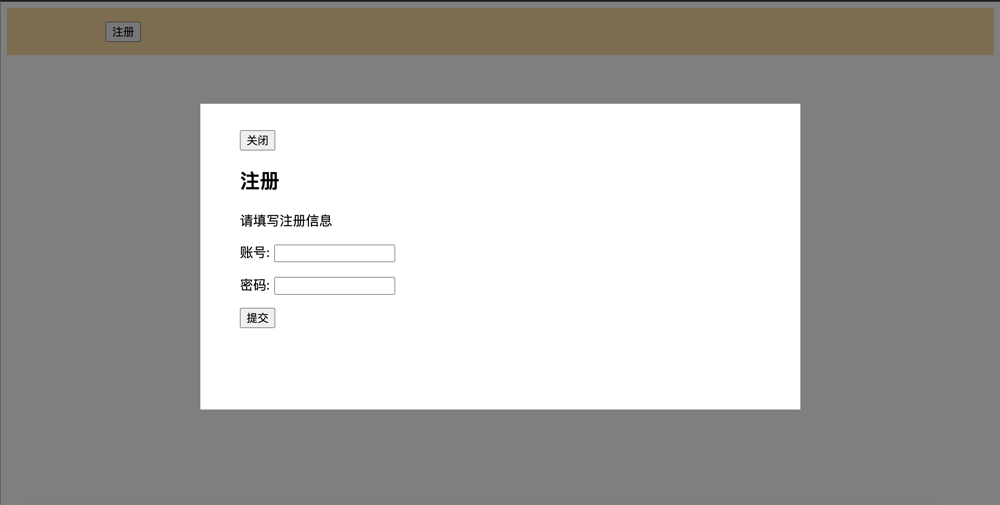

import BrowserWindow from '@site/src/components/BrowserWindow';
import Tabs from '@theme/Tabs';
import TabItem from '@theme/TabItem';

# 七、定位
定位使用`position`属性。position属性的初始值是static，如果把它改成其他值，我们就说元素就被定位了；而如果元素使用了静态定位，那么就说它未被定位。

## 1 固定定位

给一个元素设置`position: fixed`就能将元素放在视口的任意位置，它搭配四种属性一起使用：top、right、bottom和left。这些属性的值决定了固定定位的元素与浏览器视口边缘的距离。

设置这四个值还隐式地定义了元素的宽高。比如指定`left: 2em; right: 2em`表示元素宽度等于视口总宽度减去4em。

### 1.1 创建模态框

固定定位最常用的场景就是模态框，模态框的代码如下所示：

```mdx-code-block
<Tabs>
<TabItem value="html" label="HTML">
```

```html
<body>
  <header class="top-banner">
    <div class="top-banner-inner">
      <button id="modal-open">注册</button>
    </div>
  </header>
  <div class="modal" id="modal">
    <div class="modal-backdrop"></div>
    <div class="modal-body">
      <button id="modal-close">关闭</button>
      <h2>注册</h2>
      <p>请填写注册信息</p>
      <form>
        <p>
          <label for="username">账号:</label>
          <input type="text" name="username"/>
        </p>
        <p>
          <label for="password">密码:</label>
          <input type="password" name="password"/>
        </p>
        <p><button type="modal-submit">提交</button></p>
      </form>
    </div>
  </div>
</body>
```

```mdx-code-block
</TabItem>
<TabItem value="css" label="CSS">
```

```css
.top-banner {
  padding: 1em 0;
  background-color: #ffd698;
}

.top-banner-inner {
  width: 80%;
  max-width: 1000px;
  margin: 0 auto;
}

.modal {
  display: none;
}

.modal-backdrop {
  position: fixed;
  top: 0;
  right: 0;
  bottom: 0;
  left: 0;
  background-color: rgba(0, 0, 0, 0.5);
}

.modal-body {
  position: fixed;
  top: 20%;
  bottom: 20%;
  right: 20%;
  left: 20%;
  padding: 2em 3em;
  background-color: white;
  overflow: auto;
}

#modal-close {
  cursor: pointer;
}
```

```mdx-code-block
</TabItem>
<TabItem value="js" label="JavaScript">
```

```js
var button = document.getElementById('modal-open');
var close = document.getElementById('modal-close');
var modal = document.getElementById('modal');

button.addEventListener('click', function(event) {
  event.preventDefault();
  modal.style.display = 'block';
});

close.addEventListener('click', function(event) {
  event.preventDefault();
  modal.style.display = 'none';
});
```

```mdx-code-block
</TabItem>
</Tabs>
```

这段CSS里，使用了两次固定定位。第一次是modal-backdrop构建一个遮罩，四个方向都设置为0。这让遮罩填满整个视口。

<BrowserWindow>



</BrowserWindow>

第二次是modal-body构建了一个内容填写区域。它的四条边都在视口内：顶边和底边到视口对应的边缘为20%，左边和右边距离视口对应的边缘为20%。

:::tip
定位一个元素时，不要求指定四个方向的值，可以只指定需要的方向值，然后用width和/或height来决定它的大小，也可以让元素本身来决定大小。
:::

## 2 绝对定位

固定定位让元素相对视口定位，此时视口被称作元素的包含块。绝对定位的行为也是如此，只是它的包含块不一样。绝对定位不是相对视口，而是相对最近的祖先定位元素。

### 2.1 关闭按钮的定位

接下来使用绝对定位将关闭按钮移到右上角，代码如下所示：

```mdx-code-block
<Tabs>
<TabItem value="html" label="HTML">
```

```html
<body>
  <header class="top-banner">
    <div class="top-banner-inner">
      <button id="modal-open">注册</button>
    </div>
  </header>
  <div class="modal" id="modal">
    <div class="modal-backdrop"></div>
    <div class="modal-body">
      <button id="modal-close"></button>
      <h2>注册</h2>
      <p>请填写注册信息</p>
      <form>
        <p>
          <label for="username">账号:</label>
          <input type="text" name="username"/>
        </p>
        <p>
          <label for="password">密码:</label>
          <input type="password" name="password"/>
        </p>
        <p><button type="modal-submit">提交</button></p>
      </form>
    </div>
  </div>
</body>
```

```mdx-code-block
</TabItem>
<TabItem value="css" label="CSS">
```

```css
.top-banner {
  padding: 1em 0;
  background-color: #ffd698;
}

.top-banner-inner {
  width: 80%;
  max-width: 1000px;
  margin: 0 auto;
}

.modal {
  display: none;
}

.modal-backdrop {
  position: fixed;
  top: 0;
  right: 0;
  bottom: 0;
  left: 0;
  background-color: rgba(0, 0, 0, 0.5);
}

.modal-body {
  position: fixed;
  top: 20%;
  bottom: 20%;
  right: 20%;
  left: 20%;
  padding: 2em 3em;
  background-color: white;
  overflow: auto;
}

#modal-close {
  border: 0;
  cursor: pointer;
  position: absolute;
  top: 0;
  right: 0;
  padding: 0.3em;
  font-size: 2em;
  height: 1.5em;
  width: 1.5em;
  cursor: pointer;
}
#modal-close::before {
  display: block;
  content: '\00D7';
}
```

```mdx-code-block
</TabItem>
<TabItem value="js" label="JavaScript">
```

```js
var button = document.getElementById('modal-open');
var close = document.getElementById('modal-close');
var modal = document.getElementById('modal');

button.addEventListener('click', function(event) {
  event.preventDefault();
  modal.style.display = 'block';
});

close.addEventListener('click', function(event) {
  event.preventDefault();
  modal.style.display = 'none';
});
```

```mdx-code-block
</TabItem>
</Tabs>
```

这段代码将按钮放在距离modal-body顶部0.3em、右侧0.3em的位置。通常情况下，包含块是元素的父元素。**如果父元素未被定位**，那么浏览器会沿着DOM树往上找它的祖父、曾祖父，直到找到一个定位元素，用它作为包含块。

接下来要把关闭按钮里的内容为x。做法是将按钮的：:after伪元素的content属性设置为x，并让伪元素绝对定位到按钮中间。

效果如下图所示：

<BrowserWindow>


</BrowserWindow>

:::tip
为什么不把按钮里的文字close换成x，但是这会导致可访问性的问题：辅助的屏幕阅读器会读按钮里的文字。因此要给这个按钮一些有意义的提示。在使用CSS之前，HTML本身必须有意义。
:::

## 3 相对定位

使用`position: relative`可以将元素设置为相对定位，通常看不到页面上有任何视觉改变。

如果加上top、right、bottom和left属性，元素就会从原来的位置移走，但是不会改变它周围任何元素的位置。如下图所示，给第二个元素设置相对定位后，它会出现偏移，但是不会影响之前元素的布局。

<BrowserWindow>


</BrowserWindow>

### 3.1 创建下拉菜单

使用绝对定位配合相对定位可以构建一个下拉菜单。代码如下所示：

```mdx-code-block
<Tabs>
<TabItem value="html" label="HTML">
```

```html
<body>
  <header class="top-banner">
    <div class="top-banner-inner">
      <button id="modal-open">注册</button>
    </div>
  </header>
  <div class="modal" id="modal">
    <div class="modal-backdrop"></div>
    <div class="modal-body">
      <button id="modal-close"></button>
      <h2>注册</h2>
      <p>请填写注册信息</p>
      <form>
        <p>
          <label for="username">账号:</label>
          <input type="text" name="username"/>
        </p>
        <p>
          <label for="password">密码:</label>
          <input type="password" name="password"/>
        </p>
        <p><button type="modal-submit">提交</button></p>
      </form>
    </div>
  </div>
  <div class="container">
    <nav>
      <div class="dropdown">
        <div class="dropdown-label">Main Menu</div>
        <div class="dropdown-menu">
          <ul class="submenu">
            <li><a href="/">Home</a></li>
            <li><a href="/coffees">Coffees</a></li>
            <li><a href="/brewers">Brewers</a></li>
            <li><a href="/specials">Specials</a></li>
            <li><a href="/about">About us</a></li>
          </ul>
        </div>
      </div>
    </nav>
    <h1>Wombat Coffee Roasters</h1>
  </div>
</body>
```

```mdx-code-block
</TabItem>
<TabItem value="css" label="CSS">
```

```css
.top-banner {
  padding: 1em 0;
  background-color: #ffd698;
}

.top-banner-inner {
  width: 80%;
  max-width: 1000px;
  margin: 0 auto;
}

.modal {
  display: none;
}

.modal-backdrop {
  position: fixed;
  top: 0;
  right: 0;
  bottom: 0;
  left: 0;
  background-color: rgba(0, 0, 0, 0.5);
}

.modal-body {
  position: fixed;
  top: 20%;
  bottom: 20%;
  right: 20%;
  left: 20%;
  padding: 2em 3em;
  background-color: white;
  overflow: auto;
}

#modal-close {
  border: 0;
  cursor: pointer;
  position: absolute;
  top: 0;
  right: 0;
  padding: 0.3em;
  font-size: 2em;
  height: 1.5em;
  width: 1.5em;
  cursor: pointer;
}
#modal-close::before {
  display: block;
  content: '\00D7';
}
.container {
  width: 80%;
  max-width: 1000px;
  margin: 1em auto
}

.dropdown {
  display: inline-block;
  position: relative;
}

.dropdown-label {
  padding: 0.5em 1.5em;
  border: 1px solid #ccc;
  background-color: #eee;
}

.dropdown-menu {
  display: none;
  position: absolute;
  left: 0;
  top: 2.1em;
  min-width: 100%;
  background-color: #eee;
}
.dropdown:hover .dropdown-menu {
  display: block;
}

.submenu {
  padding-left: 0;
  margin: 0;
  list-style-type: none;
  border: 1px solid #999;
}

.submenu > li + li {
  border-top: 1px solid #999;
}

.submenu > li > a {
  display: block;
  padding: 0.5em 1.5em;
  background-color: #eee;
  color: #369;
  text-decoration: none;
}

.submenu > li > a:hover {
  background-color: #fff;
}

```

```mdx-code-block
</TabItem>
<TabItem value="js" label="JavaScript">
```

```js
var button = document.getElementById('modal-open');
var close = document.getElementById('modal-close');
var modal = document.getElementById('modal');

button.addEventListener('click', function(event) {
  event.preventDefault();
  modal.style.display = 'block';
});

close.addEventListener('click', function(event) {
  event.preventDefault();
  modal.style.display = 'none';
});
```

```mdx-code-block
</TabItem>
</Tabs>
```

这段代码外层的dropdown设置成相对定位，下拉框dropdown-menu设置成绝对定位。这样一来，dropdown元素就成了dropdown-menu元素的包含块。下拉框dropdown-menu元素设置的left、top等属性也是参照dropdown元素来进行定位。最终效果如下图所示：

<BrowserWindow>


</BrowserWindow>

为什么要给父元素设置为相对定位？

这是因为，绝对定位的包含块是从该元素开始从上不断寻找父元素，直到找到设置了定位的父元素。如果没找到，就以浏览器视窗作为包含块。很显然，这里下拉菜单的包含块应当是dropdown元素。那么就应当对dropdown设置定位。如果dropdown设置为fixed或者position，那么它将脱离文档流，定位的对象成为浏览器视窗。这样它的位置就变得不可控了。因此将定位设置为relative后，它仍然在文档流中，位置也是可预知的。

### 3.2 绘制三角形

可以用边框画一个三角形当作向下箭头。这里用标签的：:after伪元素来画三角形，然后使用绝对定位将它放到标签的右边。

三角形绘制的原理：大多数情况下，我们会给一个元素加上较细的边框，通常1px或者2px就够了。但如果把边框变得很粗，边框的区域就会如下所示。

<BrowserWindow>


</BrowserWindow>

如果将元素的宽和高缩小到0时，元素四周的边都变成了三角形。

<BrowserWindow>


</BrowserWindow>

所以，可以添加如下所示的css代码，来创建一个向上和向下的三角形箭头。

```css
.dropdown-label {
  padding: 0.5em 2em 0.5em 1.5em;
  border: 1px solid #ccc;
  background-color: #eee;
}

.dropdown-label::after {
  content: "";
  position: absolute;
  right: 1em;
  top: 1em;
  border: 0.3em solid;
  border-color: black transparent transparent;
}
.dropdown:hover .dropdown-label::after {
  top: 0.7em;
  border-color: transparent transparent black;
}
```

效果如下图所示：

<BrowserWindow>


</BrowserWindow>

## 4. 层叠上下文（z-index）

定位非常有用，但也需要弄清楚它会带来什么后果。当把一个元素从文档流中移除时，我们就需要管理之前由文档流处理的所有事情了。

层叠就是其中的一个问题。在同一页面定位多个元素时，可能会遇到两个不同定位的元素重叠的现象。有时我们会发现“错误”的元素出现在其他元素之前。

### 4.1 层叠问题

比如在之前的代码中，注册对话框设置了固定定位，下拉菜单设置了相对定位和绝对定位。当点击注册按钮打开对话框示，下拉菜单跑到了注册对话框的上面，很显然这是不对的，这样也就失去了注册模态框设置遮罩的目的。

<BrowserWindow>


</BrowserWindow>

浏览器会先绘制所有非定位的元素，然后绘制定位元素。默认情况下，所有的定位元素会出现在非定位元素前面。可以使用z-index解决上述问题。

```css
.modal-backdrop {
  position: fixed;
  top: 0;
  right: 0;
  bottom: 0;
  left: 0;
  background-color: rgba(0, 0, 0, 0.5);
  z-index: 1;
}

.modal-body {
  position: fixed;
  top: 3em;
  bottom: 3em;
  right: 20%;
  left: 20%;
  padding: 2em 3em;
  background-color: white;
  overflow: auto;
  z-index: 2;
}
```

### 4.2 层叠上下文顺序

虽然z-index可以解决元素的层叠问题，但是有时候设置z-index会不起作用。比如下面这段代码:

```mdx-code-block
<Tabs>
<TabItem value="html" label="HTML">
```

```html
<body>
  <div class="box one positioned">
    one
    <div class="absolute">nested</div>
  </div>
  <div class="box two positioned">two</div>
  <div class="box three">three</div>
</body>
```

```mdx-code-block
</TabItem>
<TabItem value="css" label="CSS">
```

```css
body {
  margin: 40px;
}

.box {
  display: inline-block;
  height: 200px;
  width: 200px;
  line-height: 200px;
  text-align: center;
  border: 2px solid black;
  background-color: #ea5;
  margin-left: -60px;
  vertical-align: top;
}

.one {
  margin-left: 0;
}

.two {
  margin-top: 30px;
}

.three {
  margin-top: 60px;
}

.positioned {
  position: relative;
  background-color: #5ae;
  z-index: 1;
}

.absolute {
  position: absolute;
  top: 1em;
  right: 1em;
  height: 2em;
  background-color: #fff;
  border: 2px dashed #888;
  z-index: 100;
  line-height: initial;
  padding: 1em;
}
```

```mdx-code-block
</TabItem>
</Tabs>
```


最终效果如下所示，可以看到nested设置了`z-index: 100` ，但是它仍然在two的下面。

<BrowserWindow>


</BrowserWindow>

叠放在第二个盒子后面的第一个盒子是一个层叠上下文的根。因此，虽然它的内部元素的z-index值很高，但是它内部的绝对定位元素不会跑到第二个盒子前面。

所有层叠上下文内的元素会按照以下顺序，从后到前叠放：

- 层叠上下文的根
- z-index为负的定位元素（及其子元素）
- 非定位元素
- z-index为auto的定位元素（及其子元素）
- z-index为正的定位元素（及其子元素）

如果发现z-index没有按照预期表现，就在DOM树里往上找到元素的祖先节点，直到发现层叠上下文的根。然后给它设置z-idnex，将整个层叠上下文向前或者向后放。还要注意多个层叠上下文嵌套的情况。

定位会将元素拉出文档流。**一般来说，只有在需要将元素叠放到别的元素之前时，才应该用定位。**

## 5. 粘性定位

粘性定位（sticky positioning）。它是相对定位和固定定位的结合体：正常情况下，元素会随着页面滚动，当到达屏幕的特定位置时，如果用户继续滚动，它就会“锁定”在这个位置。

最常见的用例是侧边栏导航。下面将在之前的代码基础上增加一个侧边导航栏

```mdx-code-block
<Tabs>
<TabItem value="html" label="HTML">
```

```html
<body>
  <header class="top-banner">
    <div class="top-banner-inner">
      <p>Find out what's going on at Wombat Coffee each
        month. Sign up for our newsletter:
        <button id="open">Sign up</button>
      </p>
    </div>
  </header>
  <div class="modal" id="modal">
    <div class="modal-backdrop"></div>
    <div class="modal-body">
      <button class="modal-close" id="close">
        <span class="sr-only">close</span>
      </button>
      <h2>Wombat Newsletter</h2>
      <p>Sign up for our monthly newsletter. No spam.
         We promise!</p>
      <form>
        <p>
          <label for="email">Email address:</label>
          <input type="text" name="email"/>
        </p>
        <p><button type="submit">Submit</button></p>
      </form>
    </div>
  </div>

  <div class="container">
    <main class="col-main">
      <nav>
        <div class="dropdown">
          <div class="dropdown-label">Main Menu</div>
          <div class="dropdown-menu">
            <ul class="submenu">
              <li><a href="/">Home</a></li>
              <li><a href="/coffees">Coffees</a></li>
              <li><a href="/brewers">Brewers</a></li>
              <li><a href="/specials">Specials</a></li>
              <li><a href="/about">About us</a></li>
            </ul>
          </div>
        </div>
      </nav>
      <h1>Wombat Coffee Roasters</h1>
    </main>

    <aside class="col-sidebar">
      <div class="affix">
        <ul class="submenu">
          <li><a href="/">Home</a></li>
          <li><a href="/coffees">Coffees</a></li>
          <li><a href="/brewers">Brewers</a></li>
          <li><a href="/specials">Specials</a></li>
          <li><a href="/about">About us</a></li>
        </ul>
      </div>
    </aside>
  </div>
</body>
```

```mdx-code-block
</TabItem>
<TabItem value="css" label="CSS">
```

```css
body {
  font-family: Helvetica, Arial, sans-serif;
  min-height: 200vh;
  margin: 0;
}

button {
  padding: .5em .7em;
  border: 1px solid #8d8d8d;
  background-color: white;
  font-size: 1em;
}

.top-banner {
  padding: 1em 0;
  background-color: #ffd698;
}

.top-banner-inner {
  width: 80%;
  max-width: 1000px;
  margin: 0 auto;
}

.modal {
  display: none;
}

.modal-backdrop {
  position: fixed;
  top: 0;
  right: 0;
  bottom: 0;
  left: 0;
  background-color: rgba(0, 0, 0, 0.5);
  z-index: 1;
}

.modal-body {
  position: fixed;
  top: 3em;
  bottom: 3em;
  right: 20%;
  left: 20%;
  padding: 2em 3em;
  background-color: white;
  overflow: auto;
  z-index: 2;
}

.modal-close {
  position: absolute;
  top: 0;
  right: 0;
  padding: 0.3em;
  font-size: 2em;
  height: 1.5em;
  width: 1.5em;
  cursor: pointer;
  border: 0;
}
.modal-close::before {
  display: block;
  content: '\00D7';
}

.sr-only {
  position: absolute;
  width: 1px;
  height: 1px;
  padding: 0;
  margin: -1px;
  overflow: hidden;
}

.container {
  display: flex;
  width: 80%;
  max-width: 1000px;
  margin: 1em auto;
  min-height: 100vh;
}

.dropdown {
  display: inline-block;
  position: relative;
}

.dropdown-label {
  padding: 0.5em 2em 0.5em 1.5em;
  border: 1px solid #ccc;
  background-color: #eee;
}

.dropdown-label::after {
  content: "";
  position: absolute;
  right: 1em;
  top: 1em;
  border: 0.3em solid;
  border-color: black transparent transparent;
}
.dropdown:hover .dropdown-label::after {
  top: 0.7em;
  border-color: transparent transparent black;
}

.dropdown-menu {
  display: none;
  position: absolute;
  left: 0;
  top: 2.1em;
  min-width: 100%;
  background-color: #eee;
}
.dropdown:hover .dropdown-menu {
  display: block;
}

.submenu {
  padding-left: 0;
  margin: 0;
  list-style-type: none;
  border: 1px solid #999;
}

.submenu > li + li {
  border-top: 1px solid #999;
}

.submenu > li > a {
  display: block;
  padding: .5em 1.5em;
  background-color: #eee;
  color: #369;
  text-decoration: none;
}

.submenu > li > a:hover {
  background-color: #fff;
}

.col-main {
  flex: 1 80%;
}

.col-sidebar {
  flex: 20%;
}

.affix {
  position: sticky;
  top: 1em;
}

```

```mdx-code-block
</TabItem>
<TabItem value="js" label="JavaScript">
```

```js
var button = document.getElementById('open');
var close = document.getElementById('close');
var modal = document.getElementById('modal');

button.addEventListener('click', function(event) {
  event.preventDefault();
  modal.style.display = 'block';
});

close.addEventListener('click', function(event) {
  event.preventDefault();
  modal.style.display = 'none';
});
```

```mdx-code-block
</TabItem>
</Tabs>
```

效果如下所示，可以看到随着浏览器向下滚动，右侧导航栏一起滚动，当导航栏触顶后停止滚动。当浏览器滚动调即将触底时，导航栏又开始向上滚动。

<BrowserWindow>


</BrowserWindow>


这是因为粘性元素永远不会超出父元素的范围，当滚动页面的时候，col-sidebar会一直正常滚动，但是affix会在滚动到特定位置时停下来。如果继续滚动得足够远，粘性元素还会恢复滚动。这种情况只在父元素的底边到达粘性元素的底边时发生。